US Wildfires and Drought
================
Richard Railton
11/4/2021

## Wildfire Data Source Abstract

The data publication contains a spatial database of wildfires that
occurred in the United States from 1992 to 2018. It is the fourth update
of a publication originally generated to support the national Fire
Program Analysis (FPA) system. The wildfire records were acquired from
the reporting systems of federal, state, and local fire organizations.
The following core data elements were required for records to be
included in this data publication: discovery date, final fire size, and
a point location at least as precise as a Public Land Survey System
(PLSS) section (1-square mile grid). The data were transformed to
conform, when possible, to the data standards of the National Wildfire
Coordinating Group (NWCG), including an updated wildfire-cause standard
(approved August 2020). Basic error-checking was performed and redundant
records were identified and removed, to the degree possible. In addition
to incorporating data for 2016-2018, some previously unavailable
nonfederal wildfire records for the period 1999-2015 were acquired
either directly from the state fire services (NH, NJ) or indirectly from
an updated National Association of State Foresters database (AR, AZ, CA,
CO, FL, HI, ID, IL, OK, SD) and added. The resulting product, referred
to as the Fire Program Analysis fire-occurrence database (FPA FOD),
includes 2.17 million geo-referenced wildfire records, representing a
total of 165 million acres burned during the 27-year period.
(<https://www.fs.usda.gov/rds/archive/Catalog/RDS-2013-0009.5>)

<!-- ```{r, install-packages, tidy=TRUE, tidy.opts=list(width.cutoff=80)}
install.packages("RSQLite") #for connecting to SQLite database
install.packages("dbplyr") #for connecting to database
install.packages("dplyr") #for data manipulation
install.packages("tidyr") #for tidying data
install.packages("ggthemes") #for visual themes
install.packages("lubridate") #for date conversion
install.packages("chron") #for time conversion
install.packages("magrittr") #call and update with %<>%
install.packages("pastecs") #descriptive stats
install.packages("ggplot2") #for visuals
install.packages("mosaicData") #for correlation matrix
install.packages("ggcorrplot") #for linear regression
install.packages("scales") #for normalizing
install.packages("ggpubr") #for ggarrange
install.packages("viridis") #for color scale
install.packages("hrbrthemes") #themes for ggplot2
``` -->

``` r
library(RSQLite)  #for connecting to SQLite database
library(dbplyr)  #for connecting to database
library(dplyr)  #for data manipulation
library(tidyr)  #for tidying data
library(ggthemes)  #for visual themes
library(lubridate)  #for date conversion
library(chron)  #for time conversion
library(magrittr)  #call and update with %<>%
library(pastecs)  #descriptive stats
library(ggplot2)  #for visuals
library(mosaicData)  #for correlation matrix
library(ggcorrplot)  #for linear regression
library(scales)  #for normalizing
library(ggpubr)  #for ggarrange
library(viridis)  #for color scale
library(hrbrthemes)  #themes for ggplot2
import_roboto_condensed()  #for font
```

## Load Wildfire Data from SQLite into Dataframe

``` r
# create db connection
conn <- dbConnect(SQLite(), "FPA_FOD_20210617.sqlite")

# pull the fires table into RAM
fires <- tbl(conn, "Fires") %>%
    collect()

# check size
print(object.size(fires), units = "Gb")
```

    ## 0.8 Gb

``` r
# disconnect from db
dbDisconnect(conn)
```

``` r
glimpse(fires)
```

    ## Rows: 2,166,753
    ## Columns: 37
    ## $ FOD_ID                        <int> 1, 2, 3, 4, 5, 6, 7, 8, 9, 10, 11, 12, 1…
    ## $ FPA_ID                        <chr> "FS-1418826", "FS-1418827", "FS-1418835"…
    ## $ SOURCE_SYSTEM_TYPE            <chr> "FED", "FED", "FED", "FED", "FED", "FED"…
    ## $ SOURCE_SYSTEM                 <chr> "FS-FIRESTAT", "FS-FIRESTAT", "FS-FIREST…
    ## $ NWCG_REPORTING_AGENCY         <chr> "FS", "FS", "FS", "FS", "FS", "FS", "FS"…
    ## $ NWCG_REPORTING_UNIT_ID        <chr> "USCAPNF", "USCAENF", "USCAENF", "USCAEN…
    ## $ NWCG_REPORTING_UNIT_NAME      <chr> "Plumas National Forest", "Eldorado Nati…
    ## $ SOURCE_REPORTING_UNIT         <int> 511, 503, 503, 503, 503, 503, 503, 514, …
    ## $ SOURCE_REPORTING_UNIT_NAME    <chr> "Plumas National Forest", "Eldorado Nati…
    ## $ LOCAL_FIRE_REPORT_ID          <int> 1, 13, 27, 43, 44, 54, 58, 3, 5, 61, 64,…
    ## $ LOCAL_INCIDENT_ID             <chr> "PNF-47", "13", "021", "6", "7", "8", "9…
    ## $ FIRE_CODE                     <chr> "BJ8K", "AAC0", "A32W", NA, NA, NA, NA, …
    ## $ FIRE_NAME                     <chr> "FOUNTAIN", "PIGEON", "SLACK", "DEER", "…
    ## $ ICS_209_PLUS_INCIDENT_JOIN_ID <chr> NA, NA, NA, NA, NA, NA, NA, NA, NA, NA, …
    ## $ ICS_209_PLUS_COMPLEX_JOIN_ID  <chr> NA, NA, NA, NA, NA, NA, NA, NA, NA, NA, …
    ## $ MTBS_ID                       <chr> NA, NA, NA, NA, NA, NA, NA, NA, NA, NA, …
    ## $ MTBS_FIRE_NAME                <chr> NA, NA, NA, NA, NA, NA, NA, NA, NA, NA, …
    ## $ COMPLEX_NAME                  <chr> NA, NA, NA, NA, NA, NA, NA, NA, NA, NA, …
    ## $ FIRE_YEAR                     <int> 2005, 2004, 2004, 2004, 2004, 2004, 2004…
    ## $ DISCOVERY_DATE                <chr> "2/2/2005 0:00", "5/12/2004 0:00", "5/31…
    ## $ DISCOVERY_DOY                 <int> 33, 133, 152, 180, 180, 182, 183, 67, 74…
    ## $ DISCOVERY_TIME                <int> 1300, 845, 1921, 1600, 1600, 1800, 1800,…
    ## $ NWCG_CAUSE_CLASSIFICATION     <chr> "Human", "Natural", "Human", "Natural", …
    ## $ NWCG_GENERAL_CAUSE            <chr> "Power generation/transmission/distribut…
    ## $ NWCG_CAUSE_AGE_CATEGORY       <chr> NA, NA, NA, NA, NA, NA, NA, NA, NA, NA, …
    ## $ CONT_DATE                     <chr> "2/2/2005 0:00", "5/12/2004 0:00", "5/31…
    ## $ CONT_DOY                      <int> 33, 133, 152, 185, 185, 183, 184, 67, 74…
    ## $ CONT_TIME                     <int> 1730, 1530, 2024, 1400, 1200, 1600, 1400…
    ## $ FIRE_SIZE                     <dbl> 0.10, 0.25, 0.10, 0.10, 0.10, 0.10, 0.10…
    ## $ FIRE_SIZE_CLASS               <chr> "A", "A", "A", "A", "A", "A", "A", "B", …
    ## $ LATITUDE                      <dbl> 40.03694, 38.93306, 38.98417, 38.55917, …
    ## $ LONGITUDE                     <dbl> -121.0058, -120.4044, -120.7356, -119.91…
    ## $ OWNER_DESCR                   <chr> "USFS", "USFS", "STATE OR PRIVATE", "USF…
    ## $ STATE                         <chr> "CA", "CA", "CA", "CA", "CA", "CA", "CA"…
    ## $ COUNTY                        <chr> "63", "61", "17", "3", "3", "5", "17", N…
    ## $ FIPS_CODE                     <chr> "06063", "06061", "06017", "06003", "060…
    ## $ FIPS_NAME                     <chr> "Plumas County", "Placer County", "El Do…

``` r
head(fires, n = 20L)
```

    ## # A tibble: 20 × 37
    ##    FOD_ID FPA_ID SOURC…¹ SOURC…² NWCG_…³ NWCG_…⁴ NWCG_…⁵ SOURC…⁶ SOURC…⁷ LOCAL…⁸
    ##     <int> <chr>  <chr>   <chr>   <chr>   <chr>   <chr>     <int> <chr>     <int>
    ##  1      1 FS-14… FED     FS-FIR… FS      USCAPNF Plumas…     511 Plumas…       1
    ##  2      2 FS-14… FED     FS-FIR… FS      USCAENF Eldora…     503 Eldora…      13
    ##  3      3 FS-14… FED     FS-FIR… FS      USCAENF Eldora…     503 Eldora…      27
    ##  4      4 FS-14… FED     FS-FIR… FS      USCAENF Eldora…     503 Eldora…      43
    ##  5      5 FS-14… FED     FS-FIR… FS      USCAENF Eldora…     503 Eldora…      44
    ##  6      6 FS-14… FED     FS-FIR… FS      USCAENF Eldora…     503 Eldora…      54
    ##  7      7 FS-14… FED     FS-FIR… FS      USCAENF Eldora…     503 Eldora…      58
    ##  8      8 FS-14… FED     FS-FIR… FS      USCASHF Shasta…     514 Shasta…       3
    ##  9      9 FS-14… FED     FS-FIR… FS      USCASHF Shasta…     514 Shasta…       5
    ## 10     10 FS-14… FED     FS-FIR… FS      USCAENF Eldora…     503 Eldora…      61
    ## 11     11 FS-14… FED     FS-FIR… FS      USCAENF Eldora…     503 Eldora…      64
    ## 12     12 FS-14… FED     FS-FIR… FS      USCAENF Eldora…     503 Eldora…      71
    ## 13     13 FS-14… FED     FS-FIR… FS      USCAENF Eldora…     503 Eldora…      91
    ## 14     14 FS-14… FED     FS-FIR… FS      USCAENF Eldora…     503 Eldora…      99
    ## 15     15 FS-14… FED     FS-FIR… FS      USCAENF Eldora…     503 Eldora…     102
    ## 16     16 FS-14… FED     FS-FIR… FS      USCAENF Eldora…     503 Eldora…     103
    ## 17     17 FS-14… FED     FS-FIR… FS      USCAENF Eldora…     503 Eldora…     109
    ## 18     18 FS-14… FED     FS-FIR… FS      USCAENF Eldora…     503 Eldora…     111
    ## 19     19 FS-14… FED     FS-FIR… FS      USCAENF Eldora…     503 Eldora…     115
    ## 20     20 FS-14… FED     FS-FIR… FS      USNMLNF Lincol…     308 Lincol…       8
    ## # … with 27 more variables: LOCAL_INCIDENT_ID <chr>, FIRE_CODE <chr>,
    ## #   FIRE_NAME <chr>, ICS_209_PLUS_INCIDENT_JOIN_ID <chr>,
    ## #   ICS_209_PLUS_COMPLEX_JOIN_ID <chr>, MTBS_ID <chr>, MTBS_FIRE_NAME <chr>,
    ## #   COMPLEX_NAME <chr>, FIRE_YEAR <int>, DISCOVERY_DATE <chr>,
    ## #   DISCOVERY_DOY <int>, DISCOVERY_TIME <int>, NWCG_CAUSE_CLASSIFICATION <chr>,
    ## #   NWCG_GENERAL_CAUSE <chr>, NWCG_CAUSE_AGE_CATEGORY <chr>, CONT_DATE <chr>,
    ## #   CONT_DOY <int>, CONT_TIME <int>, FIRE_SIZE <dbl>, FIRE_SIZE_CLASS <chr>, …

``` r
fires_na_count <- sapply(fires, function(y) sum(length(which(is.na(y)))))
fires_na_count <- data.frame(fires_na_count)
fires_na_count
```

    ##                               fires_na_count
    ## FOD_ID                                     0
    ## FPA_ID                                     0
    ## SOURCE_SYSTEM_TYPE                         0
    ## SOURCE_SYSTEM                              0
    ## NWCG_REPORTING_AGENCY                      0
    ## NWCG_REPORTING_UNIT_ID                     0
    ## NWCG_REPORTING_UNIT_NAME                   0
    ## SOURCE_REPORTING_UNIT                      0
    ## SOURCE_REPORTING_UNIT_NAME                 0
    ## LOCAL_FIRE_REPORT_ID                 1701854
    ## LOCAL_INCIDENT_ID                     734948
    ## FIRE_CODE                            1797096
    ## FIRE_NAME                             939607
    ## ICS_209_PLUS_INCIDENT_JOIN_ID        2135993
    ## ICS_209_PLUS_COMPLEX_JOIN_ID         2165833
    ## MTBS_ID                              2153848
    ## MTBS_FIRE_NAME                       2153848
    ## COMPLEX_NAME                         2161081
    ## FIRE_YEAR                                  0
    ## DISCOVERY_DATE                             0
    ## DISCOVERY_DOY                              0
    ## DISCOVERY_TIME                        754468
    ## NWCG_CAUSE_CLASSIFICATION                  1
    ## NWCG_GENERAL_CAUSE                         0
    ## NWCG_CAUSE_AGE_CATEGORY              2093127
    ## CONT_DATE                             854553
    ## CONT_DOY                              854553
    ## CONT_TIME                             933151
    ## FIRE_SIZE                                  0
    ## FIRE_SIZE_CLASS                            0
    ## LATITUDE                                   0
    ## LONGITUDE                                  0
    ## OWNER_DESCR                                0
    ## STATE                                      0
    ## COUNTY                                657235
    ## FIPS_CODE                             657235
    ## FIPS_NAME                             657236

## Transform fires

``` r
# select columns we plan on using.
fires_new <- fires %>%
    select(FOD_ID, FIRE_YEAR, DISCOVERY_DATE, DISCOVERY_DOY, DISCOVERY_TIME, NWCG_CAUSE_CLASSIFICATION,
        NWCG_GENERAL_CAUSE, CONT_DATE, CONT_DOY, CONT_TIME, FIRE_SIZE, FIRE_SIZE_CLASS,
        LATITUDE, LONGITUDE, STATE, FIPS_NAME)

# rename column
fires_new <- rename(fires_new, COUNTY = FIPS_NAME)
glimpse(fires_new)
```

    ## Rows: 2,166,753
    ## Columns: 16
    ## $ FOD_ID                    <int> 1, 2, 3, 4, 5, 6, 7, 8, 9, 10, 11, 12, 13, 1…
    ## $ FIRE_YEAR                 <int> 2005, 2004, 2004, 2004, 2004, 2004, 2004, 20…
    ## $ DISCOVERY_DATE            <chr> "2/2/2005 0:00", "5/12/2004 0:00", "5/31/200…
    ## $ DISCOVERY_DOY             <int> 33, 133, 152, 180, 180, 182, 183, 67, 74, 18…
    ## $ DISCOVERY_TIME            <int> 1300, 845, 1921, 1600, 1600, 1800, 1800, 130…
    ## $ NWCG_CAUSE_CLASSIFICATION <chr> "Human", "Natural", "Human", "Natural", "Nat…
    ## $ NWCG_GENERAL_CAUSE        <chr> "Power generation/transmission/distribution"…
    ## $ CONT_DATE                 <chr> "2/2/2005 0:00", "5/12/2004 0:00", "5/31/200…
    ## $ CONT_DOY                  <int> 33, 133, 152, 185, 185, 183, 184, 67, 74, 18…
    ## $ CONT_TIME                 <int> 1730, 1530, 2024, 1400, 1200, 1600, 1400, 16…
    ## $ FIRE_SIZE                 <dbl> 0.10, 0.25, 0.10, 0.10, 0.10, 0.10, 0.10, 0.…
    ## $ FIRE_SIZE_CLASS           <chr> "A", "A", "A", "A", "A", "A", "A", "B", "B",…
    ## $ LATITUDE                  <dbl> 40.03694, 38.93306, 38.98417, 38.55917, 38.5…
    ## $ LONGITUDE                 <dbl> -121.0058, -120.4044, -120.7356, -119.9133, …
    ## $ STATE                     <chr> "CA", "CA", "CA", "CA", "CA", "CA", "CA", "C…
    ## $ COUNTY                    <chr> "Plumas County", "Placer County", "El Dorado…

``` r
# convert dates
fires_new$DISCOVERY_DATE <- as.Date(fires_new$DISCOVERY_DATE, format = "%m/%d/%Y %H:%M")
fires_new$CONT_DATE <- as.Date(fires_new$CONT_DATE, format = "%m/%d/%Y %H:%M")

# convert times
fires_new$DISCOVERY_TIME <- times(sub("(.{2})", "\\1:", sprintf("%04d:00", fires_new$DISCOVERY_TIME)))
fires_new$CONT_TIME <- times(sub("(.{2})", "\\1:", sprintf("%04d:00", fires_new$CONT_TIME)))

# convert ID to chr
fires_new %<>%
    mutate_at("FOD_ID", as.character)

# check list of states in data
unique_states <- unique(fires_new$STATE)
unique_states
```

    ##  [1] "CA" "NM" "OR" "NC" "WY" "CO" "WA" "MT" "UT" "AZ" "SD" "AR" "NV" "ID" "MN"
    ## [16] "TX" "FL" "SC" "LA" "OK" "KS" "MO" "NE" "MI" "KY" "OH" "IN" "VA" "IL" "TN"
    ## [31] "GA" "AK" "ND" "WV" "WI" "AL" "NH" "PA" "MS" "ME" "VT" "NY" "IA" "DC" "MD"
    ## [46] "CT" "MA" "NJ" "HI" "DE" "PR" "RI"

``` r
# created a list of (east/west) regions by state in csv for contiguous 48
# states to join to fires_new
regions <- read.csv("regions.csv")

# merge regions
fires_new <- left_join(fires_new, regions, by = c(STATE = "STATE"))

# remove na in REGION since I'm only interested in contiguous US
fires_new <- fires_new[!is.na(fires_new$REGION), ]

# check na count
fires_new_na_count <- sapply(fires_new, function(y) sum(length(which(is.na(y)))))
fires_new_na_count <- data.frame(fires_new_na_count)
fires_new_na_count
```

    ##                           fires_new_na_count
    ## FOD_ID                                     0
    ## FIRE_YEAR                                  0
    ## DISCOVERY_DATE                             0
    ## DISCOVERY_DOY                              0
    ## DISCOVERY_TIME                        714898
    ## NWCG_CAUSE_CLASSIFICATION                  1
    ## NWCG_GENERAL_CAUSE                         0
    ## CONT_DATE                             818560
    ## CONT_DOY                              818560
    ## CONT_TIME                             893634
    ## FIRE_SIZE                                  0
    ## FIRE_SIZE_CLASS                            0
    ## LATITUDE                                   0
    ## LONGITUDE                                  0
    ## STATE                                      0
    ## COUNTY                                621616
    ## REGION                                     0

``` r
glimpse(fires_new)
```

    ## Rows: 2,120,440
    ## Columns: 17
    ## $ FOD_ID                    <chr> "1", "2", "3", "4", "5", "6", "7", "8", "9",…
    ## $ FIRE_YEAR                 <int> 2005, 2004, 2004, 2004, 2004, 2004, 2004, 20…
    ## $ DISCOVERY_DATE            <date> 2005-02-02, 2004-05-12, 2004-05-31, 2004-06…
    ## $ DISCOVERY_DOY             <int> 33, 133, 152, 180, 180, 182, 183, 67, 74, 18…
    ## $ DISCOVERY_TIME            <times> 13:00:00, 08:45:00, 19:21:00, 16:00:00, 16…
    ## $ NWCG_CAUSE_CLASSIFICATION <chr> "Human", "Natural", "Human", "Natural", "Nat…
    ## $ NWCG_GENERAL_CAUSE        <chr> "Power generation/transmission/distribution"…
    ## $ CONT_DATE                 <date> 2005-02-02, 2004-05-12, 2004-05-31, 2004-07…
    ## $ CONT_DOY                  <int> 33, 133, 152, 185, 185, 183, 184, 67, 74, 18…
    ## $ CONT_TIME                 <times> 17:30:00, 15:30:00, 20:24:00, 14:00:00, 12…
    ## $ FIRE_SIZE                 <dbl> 0.10, 0.25, 0.10, 0.10, 0.10, 0.10, 0.10, 0.…
    ## $ FIRE_SIZE_CLASS           <chr> "A", "A", "A", "A", "A", "A", "A", "B", "B",…
    ## $ LATITUDE                  <dbl> 40.03694, 38.93306, 38.98417, 38.55917, 38.5…
    ## $ LONGITUDE                 <dbl> -121.0058, -120.4044, -120.7356, -119.9133, …
    ## $ STATE                     <chr> "CA", "CA", "CA", "CA", "CA", "CA", "CA", "C…
    ## $ COUNTY                    <chr> "Plumas County", "Placer County", "El Dorado…
    ## $ REGION                    <chr> "West", "West", "West", "West", "West", "Wes…

``` r
# check FOD_ID is unique using unique_id function from
# https://rdrr.io/github/EdwinTh/thatssorandom/src/R/unique_id.R
unique_id <- function(x, ...) {
    id_set <- x %>%
        select(...)
    id_set_dist <- id_set %>%
        distinct
    if (nrow(id_set) == nrow(id_set_dist)) {
        TRUE
    } else {
        non_unique_ids <- id_set %>%
            filter(id_set %>%
                duplicated()) %>%
            distinct()
        suppressMessages(inner_join(non_unique_ids, x) %>%
            arrange(...))
    }
}
fires_new %>%
    unique_id(FOD_ID)
```

    ## [1] TRUE

``` r
glimpse(fires_new)
```

    ## Rows: 2,120,440
    ## Columns: 17
    ## $ FOD_ID                    <chr> "1", "2", "3", "4", "5", "6", "7", "8", "9",…
    ## $ FIRE_YEAR                 <int> 2005, 2004, 2004, 2004, 2004, 2004, 2004, 20…
    ## $ DISCOVERY_DATE            <date> 2005-02-02, 2004-05-12, 2004-05-31, 2004-06…
    ## $ DISCOVERY_DOY             <int> 33, 133, 152, 180, 180, 182, 183, 67, 74, 18…
    ## $ DISCOVERY_TIME            <times> 13:00:00, 08:45:00, 19:21:00, 16:00:00, 16…
    ## $ NWCG_CAUSE_CLASSIFICATION <chr> "Human", "Natural", "Human", "Natural", "Nat…
    ## $ NWCG_GENERAL_CAUSE        <chr> "Power generation/transmission/distribution"…
    ## $ CONT_DATE                 <date> 2005-02-02, 2004-05-12, 2004-05-31, 2004-07…
    ## $ CONT_DOY                  <int> 33, 133, 152, 185, 185, 183, 184, 67, 74, 18…
    ## $ CONT_TIME                 <times> 17:30:00, 15:30:00, 20:24:00, 14:00:00, 12…
    ## $ FIRE_SIZE                 <dbl> 0.10, 0.25, 0.10, 0.10, 0.10, 0.10, 0.10, 0.…
    ## $ FIRE_SIZE_CLASS           <chr> "A", "A", "A", "A", "A", "A", "A", "B", "B",…
    ## $ LATITUDE                  <dbl> 40.03694, 38.93306, 38.98417, 38.55917, 38.5…
    ## $ LONGITUDE                 <dbl> -121.0058, -120.4044, -120.7356, -119.9133, …
    ## $ STATE                     <chr> "CA", "CA", "CA", "CA", "CA", "CA", "CA", "C…
    ## $ COUNTY                    <chr> "Plumas County", "Placer County", "El Dorado…
    ## $ REGION                    <chr> "West", "West", "West", "West", "West", "Wes…

``` r
# convert categorical variables to factors.
factor_cols <- c("FIRE_YEAR", "DISCOVERY_DOY", "NWCG_CAUSE_CLASSIFICATION", "NWCG_GENERAL_CAUSE",
    "CONT_DOY", "FIRE_SIZE_CLASS", "STATE", "COUNTY", "REGION")
fires_new %<>%
    mutate_at(factor_cols, factor)
levels(fires_new$NWCG_CAUSE_CLASSIFICATION)
```

    ## [1] "Human"                                  
    ## [2] "Missing data/not specified/undetermined"
    ## [3] "Natural"

``` r
levels(fires_new$NWCG_GENERAL_CAUSE)
```

    ##  [1] "Arson/incendiarism"                        
    ##  [2] "Debris and open burning"                   
    ##  [3] "Equipment and vehicle use"                 
    ##  [4] "Firearms and explosives use"               
    ##  [5] "Fireworks"                                 
    ##  [6] "Missing data/not specified/undetermined"   
    ##  [7] "Misuse of fire by a minor"                 
    ##  [8] "Natural"                                   
    ##  [9] "Other causes"                              
    ## [10] "Power generation/transmission/distribution"
    ## [11] "Railroad operations and maintenance"       
    ## [12] "Recreation and ceremony"                   
    ## [13] "Smoking"

``` r
# sum number of special values
is.special <- function(x) {
    if (is.numeric(x))
        !is.finite(x) else is.na(x)
}
sum(sapply(fires_new, is.special))
```

    ## [1] 3867269

``` r
# check na count
fires_new_na_count <- sapply(fires_new, function(y) sum(length(which(is.na(y)))))
fires_new_na_count <- data.frame(fires_new_na_count)
print(fires_new_na_count)
```

    ##                           fires_new_na_count
    ## FOD_ID                                     0
    ## FIRE_YEAR                                  0
    ## DISCOVERY_DATE                             0
    ## DISCOVERY_DOY                              0
    ## DISCOVERY_TIME                        714898
    ## NWCG_CAUSE_CLASSIFICATION                  1
    ## NWCG_GENERAL_CAUSE                         0
    ## CONT_DATE                             818560
    ## CONT_DOY                              818560
    ## CONT_TIME                             893634
    ## FIRE_SIZE                                  0
    ## FIRE_SIZE_CLASS                            0
    ## LATITUDE                                   0
    ## LONGITUDE                                  0
    ## STATE                                      0
    ## COUNTY                                621616
    ## REGION                                     0

``` r
# create subset cause_class where na
cause_class_na <- fires_new[is.na(fires_new$NWCG_CAUSE_CLASSIFICATION), ]
cause_class_na
```

    ## # A tibble: 1 × 17
    ##   FOD_ID   FIRE_…¹ DISCOVER…² DISCO…³ DISCO…⁴ NWCG_…⁵ NWCG_…⁶ CONT_DATE CONT_DOY
    ##   <chr>    <fct>   <date>     <fct>   <times> <fct>   <fct>   <date>    <fct>   
    ## 1 4004820… 2017    2017-03-04 63      13:00:… <NA>    Missin… NA        <NA>    
    ## # … with 8 more variables: CONT_TIME <times>, FIRE_SIZE <dbl>,
    ## #   FIRE_SIZE_CLASS <fct>, LATITUDE <dbl>, LONGITUDE <dbl>, STATE <fct>,
    ## #   COUNTY <fct>, REGION <fct>, and abbreviated variable names ¹​FIRE_YEAR,
    ## #   ²​DISCOVERY_DATE, ³​DISCOVERY_DOY, ⁴​DISCOVERY_TIME,
    ## #   ⁵​NWCG_CAUSE_CLASSIFICATION, ⁶​NWCG_GENERAL_CAUSE

``` r
# subset all general_cause with missing data
general_cause_missing <- fires_new[which(fires_new$NWCG_GENERAL_CAUSE == "Missing data/not specified/undetermined"),
    ]
general_cause_missing
```

    ## # A tibble: 513,433 × 17
    ##    FOD_ID FIRE_Y…¹ DISCOVER…² DISCO…³ DISCO…⁴ NWCG_…⁵ NWCG_…⁶ CONT_DATE  CONT_…⁷
    ##    <chr>  <fct>    <date>     <fct>   <times> <fct>   <fct>   <date>     <fct>  
    ##  1 13     2004     2004-09-03 247     16:00:… Human   Missin… 2004-09-03 247    
    ##  2 47     2005     2005-03-11 70      10:00:… Human   Missin… 2005-03-11 70     
    ##  3 52     2005     2005-05-17 137     14:00:… Human   Missin… 2005-05-17 137    
    ##  4 54     2005     2005-04-07 97      16:15:… Human   Missin… 2005-04-07 97     
    ##  5 66     2005     2005-04-24 114     19:30:… Human   Missin… 2005-04-24 114    
    ##  6 74     2005     2005-07-01 182     20:30:… Human   Missin… 2005-07-01 182    
    ##  7 76     2005     2005-07-03 184     17:45:… Human   Missin… 2005-07-03 184    
    ##  8 150    2005     2005-05-02 122     16:28:… Human   Missin… 2005-05-02 122    
    ##  9 151    2005     2005-06-21 172     11:41:… Human   Missin… 2005-06-21 172    
    ## 10 187    2005     2005-07-18 199     14:56:… Human   Missin… 2005-07-18 199    
    ## # … with 513,423 more rows, 8 more variables: CONT_TIME <times>,
    ## #   FIRE_SIZE <dbl>, FIRE_SIZE_CLASS <fct>, LATITUDE <dbl>, LONGITUDE <dbl>,
    ## #   STATE <fct>, COUNTY <fct>, REGION <fct>, and abbreviated variable names
    ## #   ¹​FIRE_YEAR, ²​DISCOVERY_DATE, ³​DISCOVERY_DOY, ⁴​DISCOVERY_TIME,
    ## #   ⁵​NWCG_CAUSE_CLASSIFICATION, ⁶​NWCG_GENERAL_CAUSE, ⁷​CONT_DOY

``` r
# subset all cause_class with missing data
cause_class_missing <- fires_new[which(fires_new$NWCG_CAUSE_CLASSIFICATION == "Missing data/not specified/undetermined"),
    ]
cause_class_missing
```

    ## # A tibble: 142,131 × 17
    ##    FOD_ID FIRE_Y…¹ DISCOVER…² DISCO…³ DISCO…⁴ NWCG_…⁵ NWCG_…⁶ CONT_DATE  CONT_…⁷
    ##    <chr>  <fct>    <date>     <fct>   <times> <fct>   <fct>   <date>     <fct>  
    ##  1 192538 1999     1999-09-13 256     18:00:… Missin… Missin… NA         <NA>   
    ##  2 201350 1998     1998-06-30 181     16:00:… Missin… Missin… NA         <NA>   
    ##  3 214669 1992     1992-06-25 177     19:38:… Missin… Missin… 1992-06-25 177    
    ##  4 214877 1994     1994-08-08 220     09:30:… Missin… Missin… 1994-08-08 220    
    ##  5 214937 1995     1995-06-03 154     11:00:… Missin… Missin… 1995-06-03 154    
    ##  6 214938 1995     1995-06-03 154     11:00:… Missin… Missin… 1995-06-03 154    
    ##  7 216231 1994     1994-06-23 174     10:00:… Missin… Missin… 1994-06-23 174    
    ##  8 216232 1994     1994-06-23 174     10:10:… Missin… Missin… 1994-06-23 174    
    ##  9 216263 1995     1995-05-10 130     13:00:… Missin… Missin… 1995-05-10 130    
    ## 10 216149 1992     1992-08-11 224     16:48:… Missin… Missin… 1992-08-11 224    
    ## # … with 142,121 more rows, 8 more variables: CONT_TIME <times>,
    ## #   FIRE_SIZE <dbl>, FIRE_SIZE_CLASS <fct>, LATITUDE <dbl>, LONGITUDE <dbl>,
    ## #   STATE <fct>, COUNTY <fct>, REGION <fct>, and abbreviated variable names
    ## #   ¹​FIRE_YEAR, ²​DISCOVERY_DATE, ³​DISCOVERY_DOY, ⁴​DISCOVERY_TIME,
    ## #   ⁵​NWCG_CAUSE_CLASSIFICATION, ⁶​NWCG_GENERAL_CAUSE, ⁷​CONT_DOY

``` r
# replace na in NWCG_CAUSE_CLASSIFICATION
fires_new$NWCG_CAUSE_CLASSIFICATION[is.na(fires_new$NWCG_CAUSE_CLASSIFICATION)] <- "Missing data/not specified/undetermined"

# outliers in cont_date
dtc_large_values <- fires_new[which(fires_new$DAYS_TO_CONT > 9490), ]
dtc_large_values
```

    ## # A tibble: 0 × 17
    ## # … with 17 variables: FOD_ID <chr>, FIRE_YEAR <fct>, DISCOVERY_DATE <date>,
    ## #   DISCOVERY_DOY <fct>, DISCOVERY_TIME <times>,
    ## #   NWCG_CAUSE_CLASSIFICATION <fct>, NWCG_GENERAL_CAUSE <fct>,
    ## #   CONT_DATE <date>, CONT_DOY <fct>, CONT_TIME <times>, FIRE_SIZE <dbl>,
    ## #   FIRE_SIZE_CLASS <fct>, LATITUDE <dbl>, LONGITUDE <dbl>, STATE <fct>,
    ## #   COUNTY <fct>, REGION <fct>

``` r
cont_future_dates <- fires_new[which(fires_new$CONT_DATE > today()), ]
cont_future_dates
```

    ## # A tibble: 39 × 17
    ##    FOD_ID  FIRE_…¹ DISCOVER…² DISCO…³ DISCO…⁴ NWCG_…⁵ NWCG_…⁶ CONT_DATE  CONT_…⁷
    ##    <chr>   <fct>   <date>     <fct>   <times> <fct>   <fct>   <date>     <fct>  
    ##  1 578071  2008    2008-04-23 114     17:21:… Natural Natural 2023-04-23 113    
    ##  2 642658  2006    2006-04-18 108     00:00:… Human   Missin… 2045-06-21 172    
    ##  3 642680  2006    2006-04-18 108     00:00:… Human   Arson/… 2030-06-18 169    
    ##  4 719640  2006    2006-06-30 181     18:29:… Natural Natural 2060-06-30 182    
    ##  5 1336443 2001    2001-06-19 170     19:19:… Human   Equipm… 2100-06-19 170    
    ##  6 201145… 2011    2011-12-08 342     17:35:… Human   Debris… 2022-12-08 342    
    ##  7 201168… 2011    2011-02-15 46      10:30:… Human   Equipm… 9999-12-31 365    
    ##  8 201168… 2011    2011-04-06 96      10:30:… Human   Debris… 9999-12-31 365    
    ##  9 201607… 2012    2012-07-07 189     16:48:… Human   Equipm… 6476-07-01 183    
    ## 10 201608… 2012    2012-08-27 240     18:30:… Natural Natural 5012-08-27 240    
    ## # … with 29 more rows, 8 more variables: CONT_TIME <times>, FIRE_SIZE <dbl>,
    ## #   FIRE_SIZE_CLASS <fct>, LATITUDE <dbl>, LONGITUDE <dbl>, STATE <fct>,
    ## #   COUNTY <fct>, REGION <fct>, and abbreviated variable names ¹​FIRE_YEAR,
    ## #   ²​DISCOVERY_DATE, ³​DISCOVERY_DOY, ⁴​DISCOVERY_TIME,
    ## #   ⁵​NWCG_CAUSE_CLASSIFICATION, ⁶​NWCG_GENERAL_CAUSE, ⁷​CONT_DOY

``` r
# replace future cont_date with na
fires_new$CONT_DATE[fires_new$CONT_DATE > today()] <- NA

# create new column discovery to containment days
fires_new$DAYS_TO_CONT <- as.numeric(difftime(fires_new$CONT_DATE, fires_new$DISCOVERY_DATE),
    units = "days")

# outliers in days_to_cont (longest burning wildfire in guinness book of
# records is 5 months roughly 150 days)
dtc_large_values <- fires_new[which(fires_new$DAYS_TO_CONT > 150), ]
dtc_large_values
```

    ## # A tibble: 484 × 18
    ##    FOD_ID FIRE_Y…¹ DISCOVER…² DISCO…³ DISCO…⁴ NWCG_…⁵ NWCG_…⁶ CONT_DATE  CONT_…⁷
    ##    <chr>  <fct>    <date>     <fct>   <times> <fct>   <fct>   <date>     <fct>  
    ##  1 17669  2006     2006-07-09 190     20:05:… Natural Natural 2006-12-11 345    
    ##  2 17677  2006     2006-07-09 190     20:05:… Natural Natural 2006-12-11 345    
    ##  3 18397  2007     2007-01-01 1       10:00:… Human   Arson/… 2007-06-11 162    
    ##  4 25401  2007     2007-08-05 217     19:00:… Natural Natural 2008-01-07 7      
    ##  5 27934  2008     2008-06-22 174     08:30:… Natural Natural 2008-12-16 351    
    ##  6 29452  2008     2008-07-07 189     17:00:… Natural Natural 2008-12-16 351    
    ##  7 31234  2008     2008-03-11 71      10:00:… Human   Recrea… 2008-09-11 255    
    ##  8 33716  2008     2008-06-22 174     12:30:… Natural Natural 2008-11-20 325    
    ##  9 34942  2008     2008-04-27 118     16:30:… Natural Natural 2009-04-27 117    
    ## 10 39338  2009     2009-01-18 18      15:30:… Human   Arson/… 2009-08-19 231    
    ## # … with 474 more rows, 9 more variables: CONT_TIME <times>, FIRE_SIZE <dbl>,
    ## #   FIRE_SIZE_CLASS <fct>, LATITUDE <dbl>, LONGITUDE <dbl>, STATE <fct>,
    ## #   COUNTY <fct>, REGION <fct>, DAYS_TO_CONT <dbl>, and abbreviated variable
    ## #   names ¹​FIRE_YEAR, ²​DISCOVERY_DATE, ³​DISCOVERY_DOY, ⁴​DISCOVERY_TIME,
    ## #   ⁵​NWCG_CAUSE_CLASSIFICATION, ⁶​NWCG_GENERAL_CAUSE, ⁷​CONT_DOY

``` r
# replace days_to_cont > 150 with NA
fires_new$DAYS_TO_CONT[fires_new$DAYS_TO_CONT > 150] <- NA

glimpse(fires_new)
```

    ## Rows: 2,120,440
    ## Columns: 18
    ## $ FOD_ID                    <chr> "1", "2", "3", "4", "5", "6", "7", "8", "9",…
    ## $ FIRE_YEAR                 <fct> 2005, 2004, 2004, 2004, 2004, 2004, 2004, 20…
    ## $ DISCOVERY_DATE            <date> 2005-02-02, 2004-05-12, 2004-05-31, 2004-06…
    ## $ DISCOVERY_DOY             <fct> 33, 133, 152, 180, 180, 182, 183, 67, 74, 18…
    ## $ DISCOVERY_TIME            <times> 13:00:00, 08:45:00, 19:21:00, 16:00:00, 16…
    ## $ NWCG_CAUSE_CLASSIFICATION <fct> Human, Natural, Human, Natural, Natural, Nat…
    ## $ NWCG_GENERAL_CAUSE        <fct> Power generation/transmission/distribution, …
    ## $ CONT_DATE                 <date> 2005-02-02, 2004-05-12, 2004-05-31, 2004-07…
    ## $ CONT_DOY                  <fct> 33, 133, 152, 185, 185, 183, 184, 67, 74, 18…
    ## $ CONT_TIME                 <times> 17:30:00, 15:30:00, 20:24:00, 14:00:00, 12…
    ## $ FIRE_SIZE                 <dbl> 0.10, 0.25, 0.10, 0.10, 0.10, 0.10, 0.10, 0.…
    ## $ FIRE_SIZE_CLASS           <fct> A, A, A, A, A, A, A, B, B, A, A, A, A, B, A,…
    ## $ LATITUDE                  <dbl> 40.03694, 38.93306, 38.98417, 38.55917, 38.5…
    ## $ LONGITUDE                 <dbl> -121.0058, -120.4044, -120.7356, -119.9133, …
    ## $ STATE                     <fct> CA, CA, CA, CA, CA, CA, CA, CA, CA, CA, CA, …
    ## $ COUNTY                    <fct> Plumas County, Placer County, El Dorado Coun…
    ## $ REGION                    <fct> West, West, West, West, West, West, West, We…
    ## $ DAYS_TO_CONT              <dbl> 0, 0, 0, 5, 5, 1, 1, 0, 0, 1, 1, 1, 0, 0, 0,…

``` r
# check na
fires_new_na_count <- sapply(fires_new, function(y) sum(length(which(is.na(y)))))
fires_new_na_count <- data.frame(fires_new_na_count)
fires_new_na_count
```

    ##                           fires_new_na_count
    ## FOD_ID                                     0
    ## FIRE_YEAR                                  0
    ## DISCOVERY_DATE                             0
    ## DISCOVERY_DOY                              0
    ## DISCOVERY_TIME                        714898
    ## NWCG_CAUSE_CLASSIFICATION                  0
    ## NWCG_GENERAL_CAUSE                         0
    ## CONT_DATE                             818599
    ## CONT_DOY                              818560
    ## CONT_TIME                             893634
    ## FIRE_SIZE                                  0
    ## FIRE_SIZE_CLASS                            0
    ## LATITUDE                                   0
    ## LONGITUDE                                  0
    ## STATE                                      0
    ## COUNTY                                621616
    ## REGION                                     0
    ## DAYS_TO_CONT                          819083

``` r
fires_new %>%
    count(DAYS_TO_CONT)
```

    ## # A tibble: 152 × 2
    ##    DAYS_TO_CONT       n
    ##           <dbl>   <int>
    ##  1            0 1089878
    ##  2            1  120743
    ##  3            2   29253
    ##  4            3   14500
    ##  5            4    8173
    ##  6            5    5746
    ##  7            6    4280
    ##  8            7    3583
    ##  9            8    2549
    ## 10            9    2097
    ## # … with 142 more rows

``` r
# replace na values in days_to_cont by state/fire_size_class group medians and
# round them
fires_new <- fires_new %>%
    group_by(FIRE_SIZE_CLASS, STATE) %>%
    mutate(DAYS_TO_CONT = ifelse(is.na(DAYS_TO_CONT), round(median(DAYS_TO_CONT,
        na.rm = TRUE)), DAYS_TO_CONT)) %>%
    ungroup()

glimpse(fires_new)
```

    ## Rows: 2,120,440
    ## Columns: 18
    ## $ FOD_ID                    <chr> "1", "2", "3", "4", "5", "6", "7", "8", "9",…
    ## $ FIRE_YEAR                 <fct> 2005, 2004, 2004, 2004, 2004, 2004, 2004, 20…
    ## $ DISCOVERY_DATE            <date> 2005-02-02, 2004-05-12, 2004-05-31, 2004-06…
    ## $ DISCOVERY_DOY             <fct> 33, 133, 152, 180, 180, 182, 183, 67, 74, 18…
    ## $ DISCOVERY_TIME            <times> 13:00:00, 08:45:00, 19:21:00, 16:00:00, 16…
    ## $ NWCG_CAUSE_CLASSIFICATION <fct> Human, Natural, Human, Natural, Natural, Nat…
    ## $ NWCG_GENERAL_CAUSE        <fct> Power generation/transmission/distribution, …
    ## $ CONT_DATE                 <date> 2005-02-02, 2004-05-12, 2004-05-31, 2004-07…
    ## $ CONT_DOY                  <fct> 33, 133, 152, 185, 185, 183, 184, 67, 74, 18…
    ## $ CONT_TIME                 <times> 17:30:00, 15:30:00, 20:24:00, 14:00:00, 12…
    ## $ FIRE_SIZE                 <dbl> 0.10, 0.25, 0.10, 0.10, 0.10, 0.10, 0.10, 0.…
    ## $ FIRE_SIZE_CLASS           <fct> A, A, A, A, A, A, A, B, B, A, A, A, A, B, A,…
    ## $ LATITUDE                  <dbl> 40.03694, 38.93306, 38.98417, 38.55917, 38.5…
    ## $ LONGITUDE                 <dbl> -121.0058, -120.4044, -120.7356, -119.9133, …
    ## $ STATE                     <fct> CA, CA, CA, CA, CA, CA, CA, CA, CA, CA, CA, …
    ## $ COUNTY                    <fct> Plumas County, Placer County, El Dorado Coun…
    ## $ REGION                    <fct> West, West, West, West, West, West, West, We…
    ## $ DAYS_TO_CONT              <dbl> 0, 0, 0, 5, 5, 1, 1, 0, 0, 1, 1, 1, 0, 0, 0,…

``` r
# check na
fires_new_na_count <- sapply(fires_new, function(y) sum(length(which(is.na(y)))))
fires_new_na_count <- data.frame(fires_new_na_count)
fires_new_na_count
```

    ##                           fires_new_na_count
    ## FOD_ID                                     0
    ## FIRE_YEAR                                  0
    ## DISCOVERY_DATE                             0
    ## DISCOVERY_DOY                              0
    ## DISCOVERY_TIME                        714898
    ## NWCG_CAUSE_CLASSIFICATION                  0
    ## NWCG_GENERAL_CAUSE                         0
    ## CONT_DATE                             818599
    ## CONT_DOY                              818560
    ## CONT_TIME                             893634
    ## FIRE_SIZE                                  0
    ## FIRE_SIZE_CLASS                            0
    ## LATITUDE                                   0
    ## LONGITUDE                                  0
    ## STATE                                      0
    ## COUNTY                                621616
    ## REGION                                     0
    ## DAYS_TO_CONT                               6

``` r
fires_new %>%
    count(DAYS_TO_CONT)
```

    ## # A tibble: 152 × 2
    ##    DAYS_TO_CONT       n
    ##           <dbl>   <int>
    ##  1            0 1870956
    ##  2            1  149831
    ##  3            2   35682
    ##  4            3   15084
    ##  5            4    9186
    ##  6            5    5912
    ##  7            6    4617
    ##  8            7    3648
    ##  9            8    2568
    ## 10            9    2106
    ## # … with 142 more rows

``` r
# subset remaining na's to review
days_to_cont_na <- fires_new[is.na(fires_new$DAYS_TO_CONT), ]
days_to_cont_na
```

    ## # A tibble: 6 × 18
    ##   FOD_ID   FIRE_…¹ DISCOVER…² DISCO…³ DISCO…⁴ NWCG_…⁵ NWCG_…⁶ CONT_DATE CONT_DOY
    ##   <chr>    <fct>   <date>     <fct>   <times> <fct>   <fct>   <date>    <fct>   
    ## 1 373439   1999    1999-04-17 107     09:00:… Missin… Missin… NA        <NA>    
    ## 2 1833591  1995    1995-08-24 236     <NA>    Human   Arson/… NA        <NA>    
    ## 3 15042262 1997    1997-10-22 295     22:01:… Human   Missin… NA        <NA>    
    ## 4 2018244… 2013    2013-05-14 134     14:45:… Human   Equipm… NA        <NA>    
    ## 5 4000040… 2016    2016-11-12 317     15:30:… Human   Missin… NA        <NA>    
    ## 6 4000364… 2016    2016-09-10 254     <NA>    Natural Natural NA        <NA>    
    ## # … with 9 more variables: CONT_TIME <times>, FIRE_SIZE <dbl>,
    ## #   FIRE_SIZE_CLASS <fct>, LATITUDE <dbl>, LONGITUDE <dbl>, STATE <fct>,
    ## #   COUNTY <fct>, REGION <fct>, DAYS_TO_CONT <dbl>, and abbreviated variable
    ## #   names ¹​FIRE_YEAR, ²​DISCOVERY_DATE, ³​DISCOVERY_DOY, ⁴​DISCOVERY_TIME,
    ## #   ⁵​NWCG_CAUSE_CLASSIFICATION, ⁶​NWCG_GENERAL_CAUSE

``` r
# replace remaining na values in days_to_cont by fire_size_class group median
# only and round them
fires_new <- fires_new %>%
    group_by(FIRE_SIZE_CLASS) %>%
    mutate(DAYS_TO_CONT = ifelse(is.na(DAYS_TO_CONT), round(median(DAYS_TO_CONT,
        na.rm = TRUE)), DAYS_TO_CONT)) %>%
    ungroup()

# check na
fires_new_na_count <- sapply(fires_new, function(y) sum(length(which(is.na(y)))))
fires_new_na_count <- data.frame(fires_new_na_count)
fires_new_na_count
```

    ##                           fires_new_na_count
    ## FOD_ID                                     0
    ## FIRE_YEAR                                  0
    ## DISCOVERY_DATE                             0
    ## DISCOVERY_DOY                              0
    ## DISCOVERY_TIME                        714898
    ## NWCG_CAUSE_CLASSIFICATION                  0
    ## NWCG_GENERAL_CAUSE                         0
    ## CONT_DATE                             818599
    ## CONT_DOY                              818560
    ## CONT_TIME                             893634
    ## FIRE_SIZE                                  0
    ## FIRE_SIZE_CLASS                            0
    ## LATITUDE                                   0
    ## LONGITUDE                                  0
    ## STATE                                      0
    ## COUNTY                                621616
    ## REGION                                     0
    ## DAYS_TO_CONT                               0

``` r
# check null
fires_new_null_count <- sapply(fires_new, function(y) sum(length(which(is.null(y)))))
fires_new_null_count <- data.frame(fires_new_null_count)
fires_new_null_count
```

    ##                           fires_new_null_count
    ## FOD_ID                                       0
    ## FIRE_YEAR                                    0
    ## DISCOVERY_DATE                               0
    ## DISCOVERY_DOY                                0
    ## DISCOVERY_TIME                               0
    ## NWCG_CAUSE_CLASSIFICATION                    0
    ## NWCG_GENERAL_CAUSE                           0
    ## CONT_DATE                                    0
    ## CONT_DOY                                     0
    ## CONT_TIME                                    0
    ## FIRE_SIZE                                    0
    ## FIRE_SIZE_CLASS                              0
    ## LATITUDE                                     0
    ## LONGITUDE                                    0
    ## STATE                                        0
    ## COUNTY                                       0
    ## REGION                                       0
    ## DAYS_TO_CONT                                 0

``` r
glimpse(fires_new)
```

    ## Rows: 2,120,440
    ## Columns: 18
    ## $ FOD_ID                    <chr> "1", "2", "3", "4", "5", "6", "7", "8", "9",…
    ## $ FIRE_YEAR                 <fct> 2005, 2004, 2004, 2004, 2004, 2004, 2004, 20…
    ## $ DISCOVERY_DATE            <date> 2005-02-02, 2004-05-12, 2004-05-31, 2004-06…
    ## $ DISCOVERY_DOY             <fct> 33, 133, 152, 180, 180, 182, 183, 67, 74, 18…
    ## $ DISCOVERY_TIME            <times> 13:00:00, 08:45:00, 19:21:00, 16:00:00, 16…
    ## $ NWCG_CAUSE_CLASSIFICATION <fct> Human, Natural, Human, Natural, Natural, Nat…
    ## $ NWCG_GENERAL_CAUSE        <fct> Power generation/transmission/distribution, …
    ## $ CONT_DATE                 <date> 2005-02-02, 2004-05-12, 2004-05-31, 2004-07…
    ## $ CONT_DOY                  <fct> 33, 133, 152, 185, 185, 183, 184, 67, 74, 18…
    ## $ CONT_TIME                 <times> 17:30:00, 15:30:00, 20:24:00, 14:00:00, 12…
    ## $ FIRE_SIZE                 <dbl> 0.10, 0.25, 0.10, 0.10, 0.10, 0.10, 0.10, 0.…
    ## $ FIRE_SIZE_CLASS           <fct> A, A, A, A, A, A, A, B, B, A, A, A, A, B, A,…
    ## $ LATITUDE                  <dbl> 40.03694, 38.93306, 38.98417, 38.55917, 38.5…
    ## $ LONGITUDE                 <dbl> -121.0058, -120.4044, -120.7356, -119.9133, …
    ## $ STATE                     <fct> CA, CA, CA, CA, CA, CA, CA, CA, CA, CA, CA, …
    ## $ COUNTY                    <fct> Plumas County, Placer County, El Dorado Coun…
    ## $ REGION                    <fct> West, West, West, West, West, West, West, We…
    ## $ DAYS_TO_CONT              <dbl> 0, 0, 0, 5, 5, 1, 1, 0, 0, 1, 1, 1, 0, 0, 0,…

## Create subsets (CA, West, East)

``` r
# create CA df
fires_new_ca <- subset(fires_new, STATE == "CA")

glimpse(fires_new_ca)
```

    ## Rows: 235,229
    ## Columns: 18
    ## $ FOD_ID                    <chr> "1", "2", "3", "4", "5", "6", "7", "8", "9",…
    ## $ FIRE_YEAR                 <fct> 2005, 2004, 2004, 2004, 2004, 2004, 2004, 20…
    ## $ DISCOVERY_DATE            <date> 2005-02-02, 2004-05-12, 2004-05-31, 2004-06…
    ## $ DISCOVERY_DOY             <fct> 33, 133, 152, 180, 180, 182, 183, 67, 74, 18…
    ## $ DISCOVERY_TIME            <times> 13:00:00, 08:45:00, 19:21:00, 16:00:00, 16…
    ## $ NWCG_CAUSE_CLASSIFICATION <fct> Human, Natural, Human, Natural, Natural, Nat…
    ## $ NWCG_GENERAL_CAUSE        <fct> Power generation/transmission/distribution, …
    ## $ CONT_DATE                 <date> 2005-02-02, 2004-05-12, 2004-05-31, 2004-07…
    ## $ CONT_DOY                  <fct> 33, 133, 152, 185, 185, 183, 184, 67, 74, 18…
    ## $ CONT_TIME                 <times> 17:30:00, 15:30:00, 20:24:00, 14:00:00, 12…
    ## $ FIRE_SIZE                 <dbl> 0.10, 0.25, 0.10, 0.10, 0.10, 0.10, 0.10, 0.…
    ## $ FIRE_SIZE_CLASS           <fct> A, A, A, A, A, A, A, B, B, A, A, A, A, B, A,…
    ## $ LATITUDE                  <dbl> 40.03694, 38.93306, 38.98417, 38.55917, 38.5…
    ## $ LONGITUDE                 <dbl> -121.0058, -120.4044, -120.7356, -119.9133, …
    ## $ STATE                     <fct> CA, CA, CA, CA, CA, CA, CA, CA, CA, CA, CA, …
    ## $ COUNTY                    <fct> Plumas County, Placer County, El Dorado Coun…
    ## $ REGION                    <fct> West, West, West, West, West, West, West, We…
    ## $ DAYS_TO_CONT              <dbl> 0, 0, 0, 5, 5, 1, 1, 0, 0, 1, 1, 1, 0, 0, 0,…

``` r
# check na
fires_new_ca_na_count <- sapply(fires_new_ca, function(y) sum(length(which(is.na(y)))))
fires_new_ca_na_count <- data.frame(fires_new_ca_na_count)
print(fires_new_ca_na_count)
```

    ##                           fires_new_ca_na_count
    ## FOD_ID                                        0
    ## FIRE_YEAR                                     0
    ## DISCOVERY_DATE                                0
    ## DISCOVERY_DOY                                 0
    ## DISCOVERY_TIME                            43080
    ## NWCG_CAUSE_CLASSIFICATION                     0
    ## NWCG_GENERAL_CAUSE                            0
    ## CONT_DATE                                103889
    ## CONT_DOY                                 103888
    ## CONT_TIME                                104527
    ## FIRE_SIZE                                     0
    ## FIRE_SIZE_CLASS                               0
    ## LATITUDE                                      0
    ## LONGITUDE                                     0
    ## STATE                                         0
    ## COUNTY                                    92678
    ## REGION                                        0
    ## DAYS_TO_CONT                                  0

``` r
# create West df
fires_new_west <- subset(fires_new, REGION == "West")

glimpse(fires_new_west)
```

    ## Rows: 990,281
    ## Columns: 18
    ## $ FOD_ID                    <chr> "1", "2", "3", "4", "5", "6", "7", "8", "9",…
    ## $ FIRE_YEAR                 <fct> 2005, 2004, 2004, 2004, 2004, 2004, 2004, 20…
    ## $ DISCOVERY_DATE            <date> 2005-02-02, 2004-05-12, 2004-05-31, 2004-06…
    ## $ DISCOVERY_DOY             <fct> 33, 133, 152, 180, 180, 182, 183, 67, 74, 18…
    ## $ DISCOVERY_TIME            <times> 13:00:00, 08:45:00, 19:21:00, 16:00:00, 16…
    ## $ NWCG_CAUSE_CLASSIFICATION <fct> Human, Natural, Human, Natural, Natural, Nat…
    ## $ NWCG_GENERAL_CAUSE        <fct> Power generation/transmission/distribution, …
    ## $ CONT_DATE                 <date> 2005-02-02, 2004-05-12, 2004-05-31, 2004-07…
    ## $ CONT_DOY                  <fct> 33, 133, 152, 185, 185, 183, 184, 67, 74, 18…
    ## $ CONT_TIME                 <times> 17:30:00, 15:30:00, 20:24:00, 14:00:00, 12…
    ## $ FIRE_SIZE                 <dbl> 0.10, 0.25, 0.10, 0.10, 0.10, 0.10, 0.10, 0.…
    ## $ FIRE_SIZE_CLASS           <fct> A, A, A, A, A, A, A, B, B, A, A, A, A, B, A,…
    ## $ LATITUDE                  <dbl> 40.03694, 38.93306, 38.98417, 38.55917, 38.5…
    ## $ LONGITUDE                 <dbl> -121.0058, -120.4044, -120.7356, -119.9133, …
    ## $ STATE                     <fct> CA, CA, CA, CA, CA, CA, CA, CA, CA, CA, CA, …
    ## $ COUNTY                    <fct> Plumas County, Placer County, El Dorado Coun…
    ## $ REGION                    <fct> West, West, West, West, West, West, West, We…
    ## $ DAYS_TO_CONT              <dbl> 0, 0, 0, 5, 5, 1, 1, 0, 0, 1, 1, 1, 0, 0, 0,…

``` r
# create East df
fires_new_east <- subset(fires_new, REGION == "East")

glimpse(fires_new_east)
```

    ## Rows: 1,130,159
    ## Columns: 18
    ## $ FOD_ID                    <chr> "37", "38", "39", "40", "41", "42", "43", "4…
    ## $ FIRE_YEAR                 <fct> 2005, 2005, 2005, 2005, 2005, 2005, 2005, 20…
    ## $ DISCOVERY_DATE            <date> 2005-03-11, 2005-01-27, 2005-02-06, 2005-02…
    ## $ DISCOVERY_DOY             <fct> 70, 27, 37, 43, 106, 129, 129, 70, 180, 195,…
    ## $ DISCOVERY_TIME            <times> 15:00:00, 22:00:00, 19:00:00, 15:20:00, 16…
    ## $ NWCG_CAUSE_CLASSIFICATION <fct> Human, Human, Human, Human, Human, Human, Hu…
    ## $ NWCG_GENERAL_CAUSE        <fct> Equipment and vehicle use, Arson/incendiaris…
    ## $ CONT_DATE                 <date> 2005-03-11, 2005-01-28, 2005-02-06, 2005-02…
    ## $ CONT_DOY                  <fct> 70, 28, 37, 44, 106, 129, 129, 70, 180, 196,…
    ## $ CONT_TIME                 <times> 18:00:00, 03:00:00, 20:00:00, 03:30:00, 22…
    ## $ FIRE_SIZE                 <dbl> 0.60, 50.30, 0.10, 125.00, 25.00, 3.00, 10.0…
    ## $ FIRE_SIZE_CLASS           <fct> B, C, A, D, C, B, C, C, A, A, A, A, A, A, A,…
    ## $ LATITUDE                  <dbl> 35.22833, 35.00028, 35.93167, 36.00167, 35.9…
    ## $ LONGITUDE                 <dbl> -82.88444, -83.35111, -81.71667, -81.59000, …
    ## $ STATE                     <fct> NC, NC, NC, NC, NC, NC, NC, NC, AR, MN, MN, …
    ## $ COUNTY                    <fct> Buncombe County, Macon County, Caldwell Coun…
    ## $ REGION                    <fct> East, East, East, East, East, East, East, Ea…
    ## $ DAYS_TO_CONT              <dbl> 0, 1, 0, 1, 0, 0, 0, 0, 0, 1, 0, 0, 0, 0, 0,…

## Import US (48 states) Drought Indicator Data (5 year SPEI) 1992 - 2020 from CSV

``` r
us_SPEI <- read.csv("drought_fig-2_US5SPEI.csv")
glimpse(us_SPEI)
```

    ## Rows: 29
    ## Columns: 2
    ## $ Year                 <int> 1992, 1993, 1994, 1995, 1996, 1997, 1998, 1999, 2…
    ## $ Five.year.SPEI.value <dbl> -0.29736869, 0.32903045, 0.44245068, 0.74043491, …

``` r
us_SPEI %<>%
    mutate_at("Year", factor)
glimpse(us_SPEI)
```

    ## Rows: 29
    ## Columns: 2
    ## $ Year                 <fct> 1992, 1993, 1994, 1995, 1996, 1997, 1998, 1999, 2…
    ## $ Five.year.SPEI.value <dbl> -0.29736869, 0.32903045, 0.44245068, 0.74043491, …

``` r
# rename column
us_SPEI <- rename(us_SPEI, US_5yr_SPEI = Five.year.SPEI.value)
glimpse(us_SPEI)
```

    ## Rows: 29
    ## Columns: 2
    ## $ Year        <fct> 1992, 1993, 1994, 1995, 1996, 1997, 1998, 1999, 2000, 2001…
    ## $ US_5yr_SPEI <dbl> -0.29736869, 0.32903045, 0.44245068, 0.74043491, 0.7170902…

## Import CA Drought Indicator Data (5 year SPEI) 1992 - 2021 from CSV

``` r
ca_SPEI <- read.csv("CA_5SPEI.csv")
glimpse(ca_SPEI)
```

    ## Rows: 30
    ## Columns: 2
    ## $ Year                 <int> 1992, 1993, 1994, 1995, 1996, 1997, 1998, 1999, 2…
    ## $ Five.year.SPEI.value <dbl> -1.19, -0.52, -0.81, 0.28, 0.36, 0.60, 0.96, 1.25…

``` r
ca_SPEI %<>%
    mutate_at("Year", factor)
glimpse(ca_SPEI)
```

    ## Rows: 30
    ## Columns: 2
    ## $ Year                 <fct> 1992, 1993, 1994, 1995, 1996, 1997, 1998, 1999, 2…
    ## $ Five.year.SPEI.value <dbl> -1.19, -0.52, -0.81, 0.28, 0.36, 0.60, 0.96, 1.25…

``` r
ca_SPEI <- rename(ca_SPEI, CA_5yr_SPEI = Five.year.SPEI.value)
glimpse(ca_SPEI)
```

    ## Rows: 30
    ## Columns: 2
    ## $ Year        <fct> 1992, 1993, 1994, 1995, 1996, 1997, 1998, 1999, 2000, 2001…
    ## $ CA_5yr_SPEI <dbl> -1.19, -0.52, -0.81, 0.28, 0.36, 0.60, 0.96, 1.25, 0.67, 0…

## Combine SPEI dataframes

``` r
combined_SPEI <- merge(us_SPEI, ca_SPEI, by = "Year", all = TRUE)
glimpse(combined_SPEI)
```

    ## Rows: 30
    ## Columns: 3
    ## $ Year        <fct> 1992, 1993, 1994, 1995, 1996, 1997, 1998, 1999, 2000, 2001…
    ## $ US_5yr_SPEI <dbl> -0.29736869, 0.32903045, 0.44245068, 0.74043491, 0.7170902…
    ## $ CA_5yr_SPEI <dbl> -1.19, -0.52, -0.81, 0.28, 0.36, 0.60, 0.96, 1.25, 0.67, 0…

``` r
# Reshape data frame
combined_SPEI_group <- data.frame(Year = combined_SPEI$Year, SPEI = c(combined_SPEI$US_5yr_SPEI,
    combined_SPEI$CA_5yr_SPEI), Location = c(rep("US_5yr_SPEI", nrow(combined_SPEI)),
    rep("CA_5yr_SPEI", nrow(combined_SPEI))))
combined_SPEI_group
```

    ##    Year        SPEI    Location
    ## 1  1992 -0.29736869 US_5yr_SPEI
    ## 2  1993  0.32903045 US_5yr_SPEI
    ## 3  1994  0.44245068 US_5yr_SPEI
    ## 4  1995  0.74043491 US_5yr_SPEI
    ## 5  1996  0.71709022 US_5yr_SPEI
    ## 6  1997  1.06105053 US_5yr_SPEI
    ## 7  1998  0.93202471 US_5yr_SPEI
    ## 8  1999  0.90186513 US_5yr_SPEI
    ## 9  2000  0.41446862 US_5yr_SPEI
    ## 10 2001  0.21723003 US_5yr_SPEI
    ## 11 2002 -0.38721720 US_5yr_SPEI
    ## 12 2003 -0.60775797 US_5yr_SPEI
    ## 13 2004 -0.71237166 US_5yr_SPEI
    ## 14 2005 -0.25630079 US_5yr_SPEI
    ## 15 2006 -0.32339736 US_5yr_SPEI
    ## 16 2007 -0.11457071 US_5yr_SPEI
    ## 17 2008 -0.18118461 US_5yr_SPEI
    ## 18 2009 -0.02593685 US_5yr_SPEI
    ## 19 2010 -0.05834806 US_5yr_SPEI
    ## 20 2011  0.30089741 US_5yr_SPEI
    ## 21 2012  0.02220695 US_5yr_SPEI
    ## 22 2013 -0.08733837 US_5yr_SPEI
    ## 23 2014 -0.06269047 US_5yr_SPEI
    ## 24 2015 -0.17811563 US_5yr_SPEI
    ## 25 2016 -0.20807585 US_5yr_SPEI
    ## 26 2017  0.17133957 US_5yr_SPEI
    ## 27 2018  0.77183745 US_5yr_SPEI
    ## 28 2019  1.05438416 US_5yr_SPEI
    ## 29 2020  1.03854978 US_5yr_SPEI
    ## 30 2021          NA US_5yr_SPEI
    ## 31 1992 -1.19000000 CA_5yr_SPEI
    ## 32 1993 -0.52000000 CA_5yr_SPEI
    ## 33 1994 -0.81000000 CA_5yr_SPEI
    ## 34 1995  0.28000000 CA_5yr_SPEI
    ## 35 1996  0.36000000 CA_5yr_SPEI
    ## 36 1997  0.60000000 CA_5yr_SPEI
    ## 37 1998  0.96000000 CA_5yr_SPEI
    ## 38 1999  1.25000000 CA_5yr_SPEI
    ## 39 2000  0.67000000 CA_5yr_SPEI
    ## 40 2001  0.33000000 CA_5yr_SPEI
    ## 41 2002 -0.05000000 CA_5yr_SPEI
    ## 42 2003 -0.98000000 CA_5yr_SPEI
    ## 43 2004 -1.04000000 CA_5yr_SPEI
    ## 44 2005 -0.73000000 CA_5yr_SPEI
    ## 45 2006 -0.16000000 CA_5yr_SPEI
    ## 46 2007 -0.26000000 CA_5yr_SPEI
    ## 47 2008 -0.53000000 CA_5yr_SPEI
    ## 48 2009 -0.74000000 CA_5yr_SPEI
    ## 49 2010 -0.80000000 CA_5yr_SPEI
    ## 50 2011 -0.60000000 CA_5yr_SPEI
    ## 51 2012 -0.56000000 CA_5yr_SPEI
    ## 52 2013 -0.61000000 CA_5yr_SPEI
    ## 53 2014 -1.03000000 CA_5yr_SPEI
    ## 54 2015 -1.65000000 CA_5yr_SPEI
    ## 55 2016 -1.93000000 CA_5yr_SPEI
    ## 56 2017 -1.38000000 CA_5yr_SPEI
    ## 57 2018 -1.45000000 CA_5yr_SPEI
    ## 58 2019 -0.61000000 CA_5yr_SPEI
    ## 59 2020 -0.61000000 CA_5yr_SPEI
    ## 60 2021 -1.10000000 CA_5yr_SPEI

``` r
# convert to factor
combined_SPEI_group %<>%
    mutate_at("Location", factor)

glimpse(combined_SPEI_group)
```

    ## Rows: 60
    ## Columns: 3
    ## $ Year     <fct> 1992, 1993, 1994, 1995, 1996, 1997, 1998, 1999, 2000, 2001, 2…
    ## $ SPEI     <dbl> -0.29736869, 0.32903045, 0.44245068, 0.74043491, 0.71709022, …
    ## $ Location <fct> US_5yr_SPEI, US_5yr_SPEI, US_5yr_SPEI, US_5yr_SPEI, US_5yr_SP…

``` r
ggp <- ggplot(combined_SPEI_group, aes(x = Year, y = SPEI, col = Location, group = Location)) +
    geom_line()
ggp
```

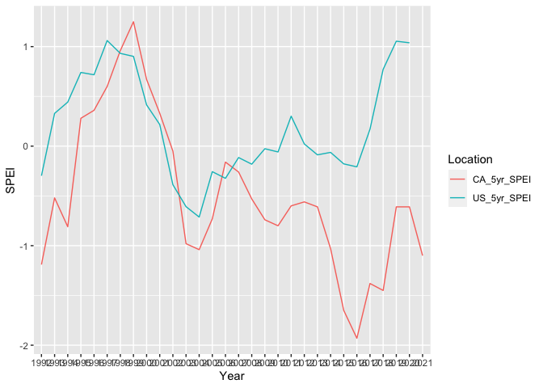

``` r
ggp <- ggplot(combined_SPEI_group, aes(Year, SPEI, fill = Location)) + geom_bar(stat = "identity",
    position = "dodge") + labs(x = "YEAR", y = "SPEI", title = "Average Five-year SPEI by Year")
ggp
```

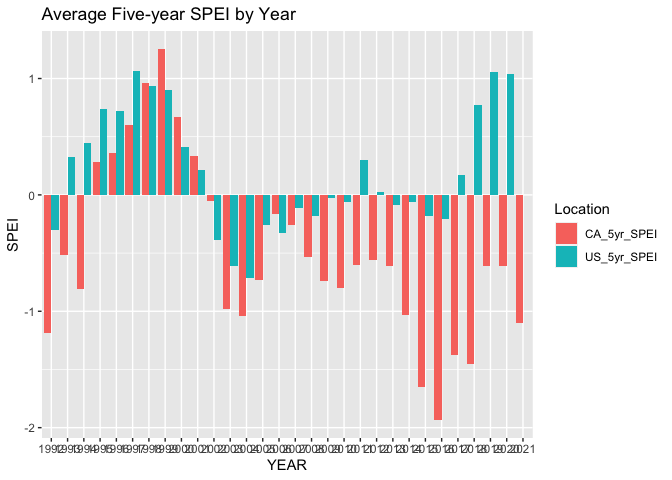

``` r
# Draw plot in different panels ggp + facet_grid(Group ~ .)
```

## Summarise datasets

``` r
summary(fires_new)  #discovered DAY_TO_CONT outliers and then found containment dates in the future so went back to transformation step to replace them with NA
```

    ##     FOD_ID            FIRE_YEAR       DISCOVERY_DATE       DISCOVERY_DOY    
    ##  Length:2120440     2006   : 114321   Min.   :1992-01-01   185    :  15613  
    ##  Class :character   2000   :  96020   1st Qu.:1999-08-04   186    :  13499  
    ##  Mode  :character   2011   :  95302   Median :2006-03-04   100    :  10503  
    ##                     2007   :  93666   Mean   :2005-10-05   101    :  10470  
    ##                     1999   :  88851   3rd Qu.:2011-12-18   108    :  10440  
    ##                     2008   :  87150   Max.   :2018-12-31   83     :  10208  
    ##                     (Other):1545130                        (Other):2049707  
    ##  DISCOVERY_TIME                               NWCG_CAUSE_CLASSIFICATION
    ##  Min.   :00:00:00   Human                                  :1670177    
    ##  1st Qu.:12:34:00   Missing data/not specified/undetermined: 142132    
    ##  Median :14:55:00   Natural                                : 308131    
    ##  Mean   :14:36:34                                                      
    ##  3rd Qu.:17:10:00                                                      
    ##  Max.   :23:59:00                                                      
    ##  NA's   :714898                                                        
    ##                                NWCG_GENERAL_CAUSE   CONT_DATE         
    ##  Missing data/not specified/undetermined:513433   Min.   :1992-01-01  
    ##  Debris and open burning                :504672   1st Qu.:2000-06-08  
    ##  Arson/incendiarism                     :309760   Median :2007-04-20  
    ##  Natural                                :308131   Mean   :2006-09-09  
    ##  Equipment and vehicle use              :175330   3rd Qu.:2013-07-16  
    ##  Recreation and ceremony                : 90826   Max.   :2021-07-24  
    ##  (Other)                                :218288   NA's   :818599      
    ##     CONT_DOY         CONT_TIME          FIRE_SIZE        FIRE_SIZE_CLASS
    ##  185    :   9587   Min.   :00:00:00   Min.   :     0.0   A: 794755      
    ##  186    :   9061   1st Qu.:13:05:00   1st Qu.:     0.1   B:1023919      
    ##  184    :   6726   Median :15:55:00   Median :     1.0   C: 242174      
    ##  187    :   6594   Mean   :15:23:35   Mean   :    61.5   D:  31636      
    ##  108    :   6478   3rd Qu.:18:10:00   3rd Qu.:     3.0   E:  15653      
    ##  (Other):1263434   Max.   :23:59:00   Max.   :662700.0   F:   8561      
    ##  NA's   : 818560   NA's   :893634                        G:   3742      
    ##     LATITUDE       LONGITUDE           STATE        
    ##  Min.   :24.58   Min.   :-124.72   CA     : 235229  
    ##  1st Qu.:33.07   1st Qu.:-110.45   GA     : 180175  
    ##  Median :35.69   Median : -93.09   TX     : 167061  
    ##  Mean   :36.98   Mean   : -95.86   NC     : 123793  
    ##  3rd Qu.:40.78   3rd Qu.: -82.55   FL     :  99356  
    ##  Max.   :49.34   Max.   : -66.97   AZ     :  93417  
    ##                                    (Other):1221409  
    ##                COUNTY         REGION         DAYS_TO_CONT     
    ##  Riverside County :  14989   East:1130159   Min.   :  0.0000  
    ##  Maricopa County  :  12984   West: 990281   1st Qu.:  0.0000  
    ##  Lincoln County   :  11852                  Median :  0.0000  
    ##  Washington County:  11815                  Mean   :  0.5043  
    ##  Jackson County   :  11458                  3rd Qu.:  0.0000  
    ##  (Other)          :1435726                  Max.   :150.0000  
    ##  NA's             : 621616

``` r
summary(combined_SPEI)
```

    ##       Year     US_5yr_SPEI        CA_5yr_SPEI     
    ##  1992   : 1   Min.   :-0.71237   Min.   :-1.9300  
    ##  1993   : 1   1st Qu.:-0.18118   1st Qu.:-1.0175  
    ##  1994   : 1   Median : 0.02221   Median :-0.6100  
    ##  1995   : 1   Mean   : 0.19359   Mean   :-0.4963  
    ##  1996   : 1   3rd Qu.: 0.71709   3rd Qu.:-0.0775  
    ##  1997   : 1   Max.   : 1.06105   Max.   : 1.2500  
    ##  (Other):24   NA's   :1

``` r
summary(combined_SPEI_group)
```

    ##       Year         SPEI                Location 
    ##  1992   : 2   Min.   :-1.9300   CA_5yr_SPEI:30  
    ##  1993   : 2   1st Qu.:-0.6100   US_5yr_SPEI:30  
    ##  1994   : 2   Median :-0.1781                   
    ##  1995   : 2   Mean   :-0.1572                   
    ##  1996   : 2   3rd Qu.: 0.3450                   
    ##  1997   : 2   Max.   : 1.2500                   
    ##  (Other):48   NA's   :1

## Descriptive Statistics

``` r
attach(fires_new)
fires_new_num <- cbind(FIRE_SIZE, LATITUDE, LONGITUDE, DAYS_TO_CONT)
options(scipen = 100)
options(digits = 2)
stat.desc(fires_new_num)
```

    ##                    FIRE_SIZE      LATITUDE      LONGITUDE DAYS_TO_CONT
    ## nbr.val        2120440.00000  2120440.0000    2120440.000 2120440.0000
    ## nbr.null             0.00000        0.0000          0.000 1870956.0000
    ## nbr.na               0.00000        0.0000          0.000       0.0000
    ## min                  0.00001       24.5817       -124.719       0.0000
    ## max             662700.00000       49.3434        -66.971     150.0000
    ## range           662699.99999       24.7617         57.748     150.0000
    ## sum          130409712.66672 78415454.4931 -203270757.872 1069271.0000
    ## median               0.97000       35.6909        -93.088       0.0000
    ## mean                61.50125       36.9807        -95.863       0.5043
    ## SE.mean              1.40406        0.0036          0.011       0.0028
    ## CI.mean.0.95         2.75192        0.0071          0.021       0.0054
    ## var            4180231.50750       27.6174        237.263      16.3207
    ## std.dev           2044.56145        5.2552         15.403       4.0399
    ## coef.var            33.24423        0.1421         -0.161       8.0114

``` r
attach(combined_SPEI)
combined_SPEI_num <- cbind(US_5yr_SPEI, CA_5yr_SPEI)
stat.desc(combined_SPEI_num)
```

    ##              US_5yr_SPEI CA_5yr_SPEI
    ## nbr.val           29.000       30.00
    ## nbr.null           0.000        0.00
    ## nbr.na             1.000        0.00
    ## min               -0.712       -1.93
    ## max                1.061        1.25
    ## range              1.773        3.18
    ## sum                5.614      -14.89
    ## median             0.022       -0.61
    ## mean               0.194       -0.50
    ## SE.mean            0.097        0.14
    ## CI.mean.0.95       0.199        0.29
    ## var                0.273        0.59
    ## std.dev            0.522        0.77
    ## coef.var           2.697       -1.55

### Histograms

``` r
# Histograms

# https://stackoverflow.com/questions/11610377/how-do-i-change-the-formatting-of-numbers-on-an-axis-with-ggplot
fancy_scientific <- function(l) {
    # turn in to character string in scientific notation
    l <- format(l, scientific = TRUE)
    # quote the part before the exponent to keep all the digits
    l <- gsub("^(.*)e", "'\\1'e", l)
    # remove + after exponent, if exists. E.g.: (3x10^+2 -> 3x10^2)
    l <- gsub("e\\+", "e", l)
    # turn the 'e+' into plotmath format
    l <- gsub("e", "%*%10^", l)
    # convert 1x10^ or 1.000x10^ -> 10^
    l <- gsub("\\'1[\\.0]*\\'\\%\\*\\%", "", l)
    # return this as an expression
    parse(text = l)
}

# us fire size
ggplot(data = fires_new, aes(x = FIRE_SIZE)) + geom_histogram(bins = 100) + scale_x_log10(breaks = trans_breaks("log10",
    function(x) 10^x), labels = trans_format("log10", math_format(10^.x))) + scale_y_continuous(labels = fancy_scientific) +
    ggtitle("US Fire Size in Acres") + ylab("FREQUENCY") + theme(title = element_text(size = 20),
    axis.title.x = element_text(size = 16), axis.text.x = element_text(size = 14),
    axis.text.y = element_text(size = 14), axis.title.y = element_text(size = 16))
```

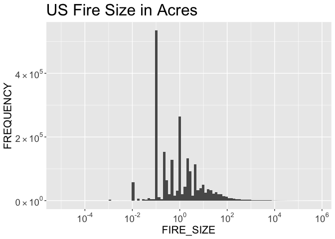

``` r
# ca fire size
ggplot(data = fires_new_ca, aes(x = FIRE_SIZE)) + geom_histogram(bins = 100) + scale_x_log10(breaks = trans_breaks("log10",
    function(x) 10^x), labels = trans_format("log10", math_format(10^.x))) + scale_y_continuous(labels = fancy_scientific) +
    ggtitle("CA Fire Size in Acres") + ylab("FREQUENCY") + theme(title = element_text(size = 20),
    axis.title.x = element_text(size = 16), axis.text.x = element_text(size = 14),
    axis.text.y = element_text(size = 14), axis.title.y = element_text(size = 16))
```

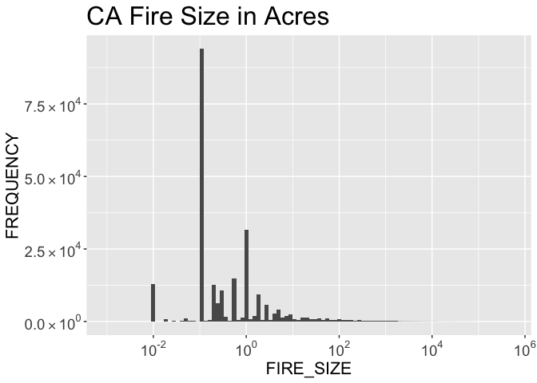

``` r
# west fire size
ggplot(data = fires_new_west, aes(x = FIRE_SIZE)) + geom_histogram(bins = 100) +
    scale_x_log10(breaks = trans_breaks("log10", function(x) 10^x), labels = trans_format("log10",
        math_format(10^.x))) + scale_y_continuous(labels = fancy_scientific) + ggtitle("West Fire Size in Acres") +
    ylab("FREQUENCY") + theme(title = element_text(size = 20), axis.title.x = element_text(size = 16),
    axis.text.x = element_text(size = 14), axis.text.y = element_text(size = 14),
    axis.title.y = element_text(size = 16))
```

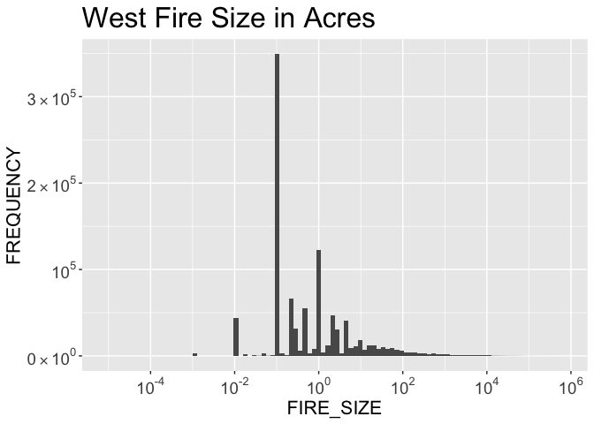

``` r
# east fire size
ggplot(data = fires_new_east, aes(x = FIRE_SIZE)) + geom_histogram(bins = 100) +
    scale_x_log10(breaks = trans_breaks("log10", function(x) 10^x), labels = trans_format("log10",
        math_format(10^.x))) + scale_y_continuous(labels = fancy_scientific) + ggtitle("East Fire Size in Acres") +
    ylab("FREQUENCY") + theme(title = element_text(size = 20), axis.title.x = element_text(size = 16),
    axis.text.x = element_text(size = 14), axis.text.y = element_text(size = 14),
    axis.title.y = element_text(size = 16))
```

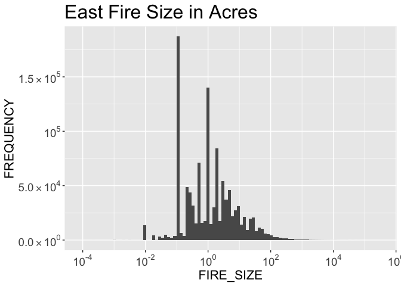

``` r
# us days to containment
ggplot(data = fires_new, aes(x = DAYS_TO_CONT)) + geom_histogram(bins = 10) + scale_x_log10(breaks = trans_breaks("log10",
    function(x) 10^x), labels = trans_format("log10", math_format(10^.x))) + scale_y_continuous(labels = fancy_scientific) +
    ggtitle("US Days To Containment") + ylab("FREQUENCY") + theme(title = element_text(size = 20),
    axis.title.x = element_text(size = 16), axis.text.x = element_text(size = 14),
    axis.text.y = element_text(size = 14), axis.title.y = element_text(size = 16))
```

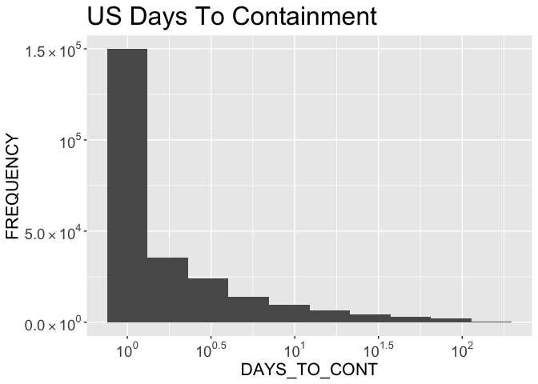

``` r
# ca days to containment
ggplot(data = fires_new_ca, aes(x = DAYS_TO_CONT)) + geom_histogram(bins = 10) +
    scale_x_log10(breaks = trans_breaks("log10", function(x) 10^x), labels = trans_format("log10",
        math_format(10^.x))) + scale_y_continuous(labels = fancy_scientific) + ggtitle("CA Days To Containment") +
    ylab("FREQUENCY") + theme(title = element_text(size = 20), axis.title.x = element_text(size = 16),
    axis.text.x = element_text(size = 14), axis.text.y = element_text(size = 14),
    axis.title.y = element_text(size = 16))
```

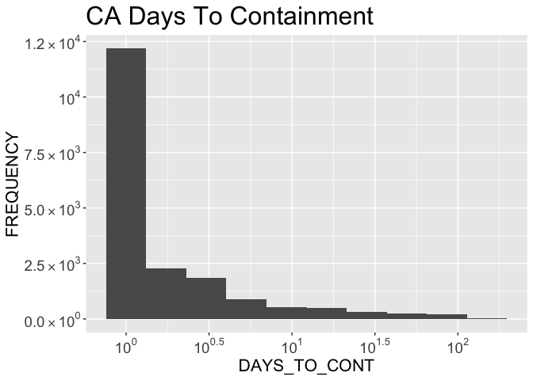

``` r
# west days to containment
ggplot(data = fires_new_west, aes(x = DAYS_TO_CONT)) + geom_histogram(bins = 10) +
    scale_x_log10(breaks = trans_breaks("log10", function(x) 10^x), labels = trans_format("log10",
        math_format(10^.x))) + scale_y_continuous(labels = fancy_scientific) + ggtitle("West Days To Containment") +
    ylab("FREQUENCY") + theme(title = element_text(size = 20), axis.title.x = element_text(size = 16),
    axis.text.x = element_text(size = 14), axis.text.y = element_text(size = 14),
    axis.title.y = element_text(size = 16))
```

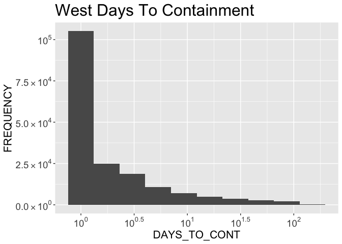

``` r
# East days to containment
ggplot(data = fires_new_east, aes(x = DAYS_TO_CONT)) + geom_histogram(bins = 10) +
    scale_x_log10(breaks = trans_breaks("log10", function(x) 10^x), labels = trans_format("log10",
        math_format(10^.x))) + scale_y_continuous(labels = fancy_scientific) + ggtitle("East Days To Containment") +
    ylab("FREQUENCY") + theme(title = element_text(size = 20), axis.title.x = element_text(size = 16),
    axis.text.x = element_text(size = 14), axis.text.y = element_text(size = 14),
    axis.title.y = element_text(size = 16))
```

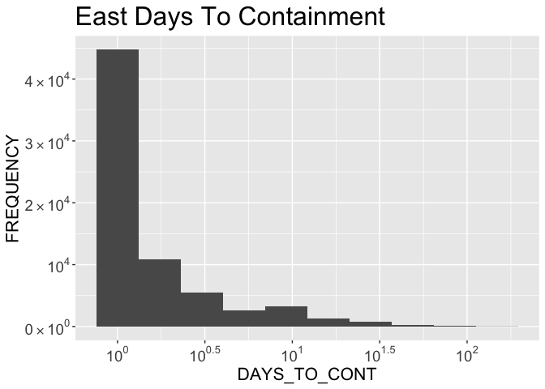
\### Boxplots

``` r
# Boxplots Fire Size, Days to Containment and SPEI, US and CA

# x labels with the number of obs for each group US
fire_year_new_xlab <- paste(levels(fires_new$FIRE_YEAR), "\n(N=", table(fires_new$FIRE_YEAR),
    ")", sep = "")
# CA
fire_year_new_ca_xlab <- paste(levels(fires_new_ca$FIRE_YEAR), "\n(N=", table(fires_new_ca$FIRE_YEAR),
    ")", sep = "")


# US fireszie
box_violin_new_fs <- ggplot(data = fires_new, aes(x = FIRE_YEAR, y = FIRE_SIZE)) +
    stat_boxplot(geom = "errorbar", width = 0.3) + geom_boxplot(varwidth = TRUE,
    alpha = 1, outlier.shape = 1, outlier.alpha = 0.5) + geom_violin(width = 1.4,
    alpha = 0.1) + scale_y_log10(breaks = trans_breaks("log10", function(x) 10^x),
    labels = trans_format("log10", math_format(10^.x))) + stat_summary(fun = mean,
    geom = "point", shape = 23, size = 3) + scale_x_discrete(labels = fire_year_new_xlab) +
    ggtitle("US Fire Size in Acres by Year") + theme(legend.position = "none", plot.title = element_text(size = 22))
box_violin_new_fs
```

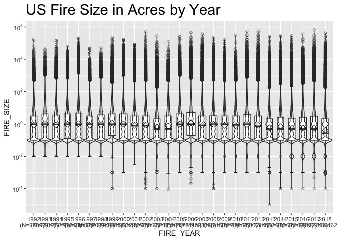

``` r
# CA firesize
box_violin_new_ca_fs <- ggplot(data = fires_new_ca, aes(x = FIRE_YEAR, y = FIRE_SIZE)) +
    stat_boxplot(geom = "errorbar", width = 0.3) + geom_boxplot(varwidth = TRUE,
    alpha = 1, outlier.shape = 1, outlier.alpha = 0.5) + geom_violin(width = 1.4,
    alpha = 0.1) + scale_y_log10(breaks = trans_breaks("log10", function(x) 10^x),
    labels = trans_format("log10", math_format(10^.x))) + stat_summary(fun = mean,
    geom = "point", shape = 23, size = 3) + scale_x_discrete(labels = fire_year_new_ca_xlab) +
    ggtitle("CA Fire Size in Acres by Year") + theme(legend.position = "none", plot.title = element_text(size = 22))
box_violin_new_ca_fs
```

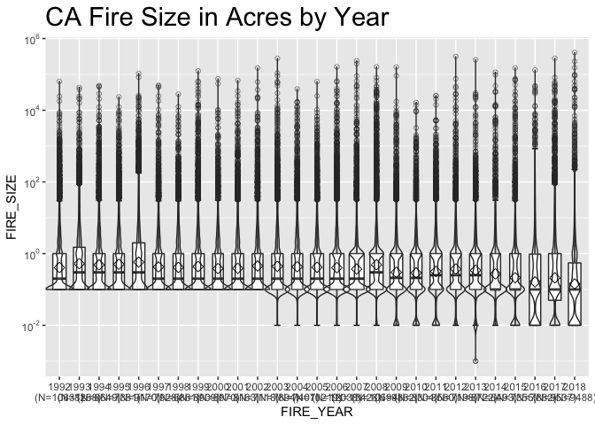

``` r
# US days to cont
box_violin_new_dtc <- ggplot(data = fires_new, aes(x = FIRE_YEAR, y = DAYS_TO_CONT)) +
    stat_boxplot(geom = "errorbar", width = 0.3) + geom_boxplot(varwidth = TRUE,
    alpha = 1, outlier.shape = 1, outlier.alpha = 0.5) + geom_violin(width = 1.4,
    alpha = 0.1) + scale_y_log10(breaks = trans_breaks("log10", function(x) 10^x),
    labels = trans_format("log10", math_format(10^.x))) + stat_summary(fun = mean,
    geom = "point", shape = 23, size = 3) + scale_x_discrete(labels = fire_year_new_xlab) +
    ggtitle("US Days to Containment by Year") + theme(legend.position = "none", plot.title = element_text(size = 22))
box_violin_new_dtc
```

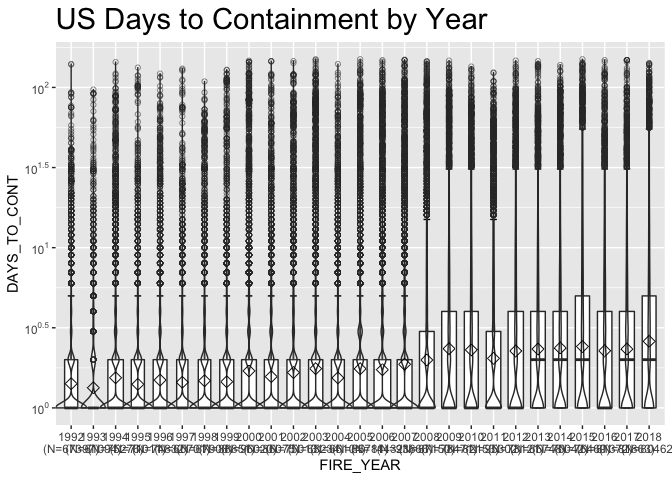

``` r
# CA days to cont
box_violin_new_ca_dtc <- ggplot(data = fires_new_ca, aes(x = FIRE_YEAR, y = DAYS_TO_CONT)) +
    stat_boxplot(geom = "errorbar", width = 0.3) + geom_boxplot(varwidth = TRUE,
    alpha = 1, outlier.shape = 1, outlier.alpha = 0.5) + geom_violin(width = 1.4,
    alpha = 0.1) + scale_y_log10(breaks = trans_breaks("log10", function(x) 10^x),
    labels = trans_format("log10", math_format(10^.x))) + stat_summary(fun = mean,
    geom = "point", shape = 23, size = 3) + scale_x_discrete(labels = fire_year_new_ca_xlab) +
    ggtitle("CA Days to Containment by Year") + theme(legend.position = "none", plot.title = element_text(size = 22))
box_violin_new_ca_dtc
```

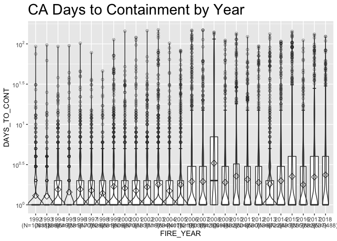

``` r
# East vs West

# x labels with the number of obs for each group West
fire_year_west_xlab <- paste(levels(fires_new_west$FIRE_YEAR), "\n(N=", table(fires_new_west$FIRE_YEAR),
    ")", sep = "")
# East
fire_year_east_xlab <- paste(levels(fires_new_east$FIRE_YEAR), "\n(N=", table(fires_new_east$FIRE_YEAR),
    ")", sep = "")


# West fireszie
box_violin_west_fs <- ggplot(data = fires_new_west, aes(x = FIRE_YEAR, y = FIRE_SIZE)) +
    stat_boxplot(geom = "errorbar", width = 0.3) + geom_boxplot(varwidth = TRUE,
    alpha = 1, outlier.shape = 1, outlier.alpha = 0.5) + geom_violin(width = 1.4,
    alpha = 0.1) + scale_y_log10(breaks = trans_breaks("log10", function(x) 10^x),
    labels = trans_format("log10", math_format(10^.x))) + stat_summary(fun = mean,
    geom = "point", shape = 23, size = 3) + scale_x_discrete(labels = fire_year_west_xlab) +
    ggtitle("West Fire Size in Acres by Year") + theme(legend.position = "none",
    plot.title = element_text(size = 22))
box_violin_west_fs
```


``` r
# East firesize
box_violin_east_fs <- ggplot(data = fires_new_east, aes(x = FIRE_YEAR, y = FIRE_SIZE)) +
    stat_boxplot(geom = "errorbar", width = 0.3) + geom_boxplot(varwidth = TRUE,
    alpha = 1, outlier.shape = 1, outlier.alpha = 0.5) + geom_violin(width = 1.4,
    alpha = 0.1) + scale_y_log10(breaks = trans_breaks("log10", function(x) 10^x),
    labels = trans_format("log10", math_format(10^.x))) + stat_summary(fun = mean,
    geom = "point", shape = 23, size = 3) + scale_x_discrete(labels = fire_year_east_xlab) +
    ggtitle("East Fire Size in Acres by Year") + theme(legend.position = "none",
    plot.title = element_text(size = 22))
box_violin_east_fs
```

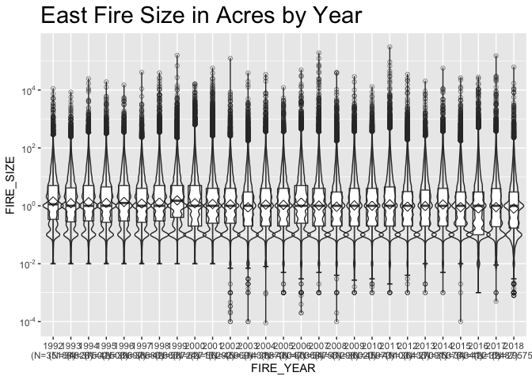

``` r
# West days to cont
box_violin_west_dtc <- ggplot(data = fires_new_west, aes(x = FIRE_YEAR, y = DAYS_TO_CONT)) +
    stat_boxplot(geom = "errorbar", width = 0.3) + geom_boxplot(varwidth = TRUE,
    alpha = 1, outlier.shape = 1, outlier.alpha = 0.5) + geom_violin(width = 1.4,
    alpha = 0.1) + scale_y_log10(breaks = trans_breaks("log10", function(x) 10^x),
    labels = trans_format("log10", math_format(10^.x))) + stat_summary(fun = mean,
    geom = "point", shape = 23, size = 3) + scale_x_discrete(labels = fire_year_west_xlab) +
    ggtitle("West Days to Containment by Year") + theme(legend.position = "none",
    plot.title = element_text(size = 22))
box_violin_west_dtc
```

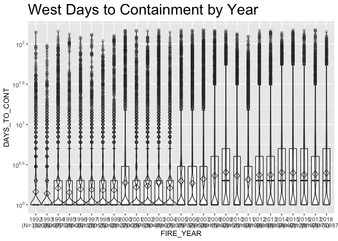

``` r
# East days to cont
box_violin_east_dtc <- ggplot(data = fires_new_east, aes(x = FIRE_YEAR, y = DAYS_TO_CONT)) +
    stat_boxplot(geom = "errorbar", width = 0.3) + geom_boxplot(varwidth = TRUE,
    alpha = 1, outlier.shape = 1, outlier.alpha = 0.5) + geom_violin(width = 1.4,
    alpha = 0.1) + scale_y_log10(breaks = trans_breaks("log10", function(x) 10^x),
    labels = trans_format("log10", math_format(10^.x))) + stat_summary(fun = mean,
    geom = "point", shape = 23, size = 3) + scale_x_discrete(labels = fire_year_east_xlab) +
    ggtitle("East Days to Containment by Year") + theme(legend.position = "none",
    plot.title = element_text(size = 22))
box_violin_east_dtc
```

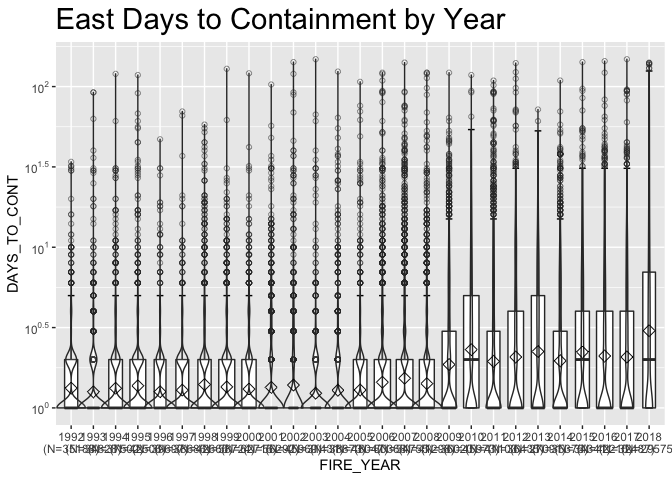

``` r
# x labels with the number of obs for each group SPEI
location_spei_xlab <- paste(levels(combined_SPEI_group$Location), "\n(N=", table(combined_SPEI_group$Location),
    ")", sep = "")

# US & CA SPEI
box_SPEI_group <- ggplot(combined_SPEI_group, aes(Location, SPEI)) + stat_boxplot(geom = "errorbar",
    width = 0.2) + geom_boxplot(notch = TRUE, varwidth = TRUE, outlier.shape = NA) +
    stat_summary(fun = mean, geom = "point", shape = 23, size = 3) + scale_x_discrete(labels = location_spei_xlab) +
    geom_jitter(width = 0.2) + ggtitle("SPEI by Location") + theme(legend.position = "none",
    plot.title = element_text(size = 22))
box_SPEI_group
```

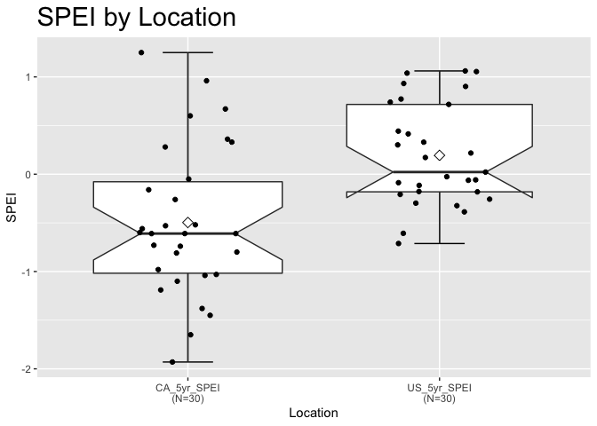
\## Visualizations

``` r
glimpse(fires_new)
```

    ## Rows: 2,120,440
    ## Columns: 18
    ## $ FOD_ID                    <chr> "1", "2", "3", "4", "5", "6", "7", "8", "9",…
    ## $ FIRE_YEAR                 <fct> 2005, 2004, 2004, 2004, 2004, 2004, 2004, 20…
    ## $ DISCOVERY_DATE            <date> 2005-02-02, 2004-05-12, 2004-05-31, 2004-06…
    ## $ DISCOVERY_DOY             <fct> 33, 133, 152, 180, 180, 182, 183, 67, 74, 18…
    ## $ DISCOVERY_TIME            <times> 13:00:00, 08:45:00, 19:21:00, 16:00:00, 16…
    ## $ NWCG_CAUSE_CLASSIFICATION <fct> Human, Natural, Human, Natural, Natural, Nat…
    ## $ NWCG_GENERAL_CAUSE        <fct> Power generation/transmission/distribution, …
    ## $ CONT_DATE                 <date> 2005-02-02, 2004-05-12, 2004-05-31, 2004-07…
    ## $ CONT_DOY                  <fct> 33, 133, 152, 185, 185, 183, 184, 67, 74, 18…
    ## $ CONT_TIME                 <times> 17:30:00, 15:30:00, 20:24:00, 14:00:00, 12…
    ## $ FIRE_SIZE                 <dbl> 0.10, 0.25, 0.10, 0.10, 0.10, 0.10, 0.10, 0.…
    ## $ FIRE_SIZE_CLASS           <fct> A, A, A, A, A, A, A, B, B, A, A, A, A, B, A,…
    ## $ LATITUDE                  <dbl> 40, 39, 39, 39, 39, 39, 39, 41, 41, 39, 39, …
    ## $ LONGITUDE                 <dbl> -121, -120, -121, -120, -120, -120, -120, -1…
    ## $ STATE                     <fct> CA, CA, CA, CA, CA, CA, CA, CA, CA, CA, CA, …
    ## $ COUNTY                    <fct> Plumas County, Placer County, El Dorado Coun…
    ## $ REGION                    <fct> West, West, West, West, West, West, West, We…
    ## $ DAYS_TO_CONT              <dbl> 0, 0, 0, 5, 5, 1, 1, 0, 0, 1, 1, 1, 0, 0, 0,…

``` r
# Fires over time

fires_new %>%
    group_by(FIRE_YEAR) %>%
    summarize(n_fires = n()) %>%
    ggplot(aes(x = FIRE_YEAR, y = n_fires/1000)) + geom_bar(stat = "identity", fill = "grey") +
    labs(x = "FIRE_YEAR", y = "Number of wildfires (thousands)", title = "US Wildfires by Year") +
    theme(title = element_text(size = 20), axis.title.x = element_text(size = 16),
        axis.text.x = element_text(size = 14), axis.text.y = element_text(size = 14),
        axis.title.y = element_text(size = 16))
```

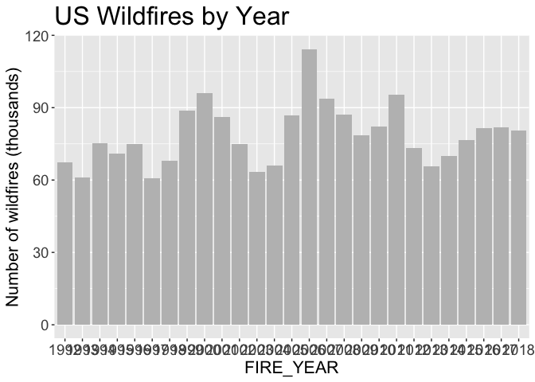

``` r
fires_new_ca %>%
    group_by(FIRE_YEAR) %>%
    summarize(n_fires = n()) %>%
    ggplot(aes(x = FIRE_YEAR, y = n_fires/1000)) + geom_bar(stat = "identity", fill = "grey") +
    labs(x = "FIRE_YEAR", y = "Number of wildfires (thousands)", title = "CA Wildfires by Year") +
    theme(title = element_text(size = 20), axis.title.x = element_text(size = 16),
        axis.text.x = element_text(size = 14), axis.text.y = element_text(size = 14),
        axis.title.y = element_text(size = 16))
```

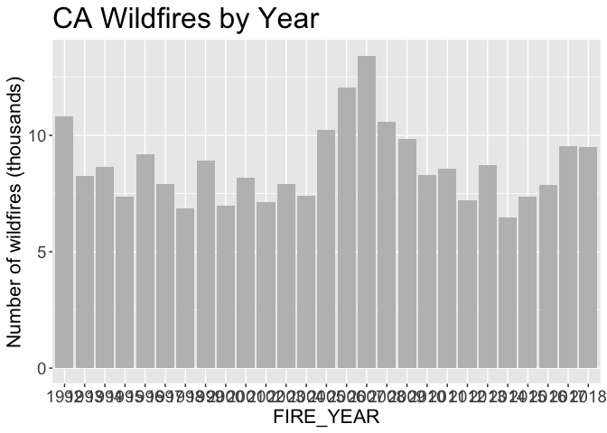

``` r
fires_new_west %>%
    group_by(FIRE_YEAR) %>%
    summarize(n_fires = n()) %>%
    ggplot(aes(x = FIRE_YEAR, y = n_fires/1000)) + geom_bar(stat = "identity", fill = "grey") +
    labs(x = "FIRE_YEAR", y = "Number of wildfires (thousands)", title = "Western States Wildfires by Year") +
    theme(title = element_text(size = 20), axis.title.x = element_text(size = 16),
        axis.text.x = element_text(size = 14), axis.text.y = element_text(size = 14),
        axis.title.y = element_text(size = 16))
```

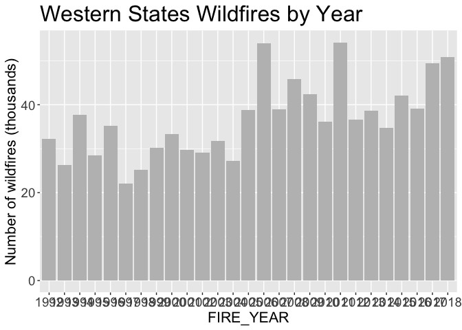

``` r
fires_new_east %>%
    group_by(FIRE_YEAR) %>%
    summarize(n_fires = n()) %>%
    ggplot(aes(x = FIRE_YEAR, y = n_fires/1000)) + geom_bar(stat = "identity", fill = "grey") +
    labs(x = "FIRE_YEAR", y = "Number of wildfires (thousands)", title = "Eastern States Wildfires by Year") +
    theme(title = element_text(size = 20), axis.title.x = element_text(size = 16),
        axis.text.x = element_text(size = 14), axis.text.y = element_text(size = 14),
        axis.title.y = element_text(size = 16))
```

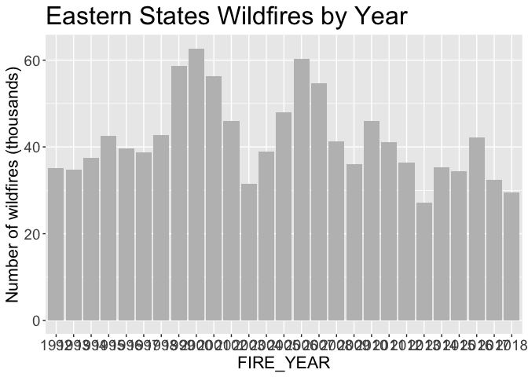

``` r
# Fires Causes

# US Fires by cause
fires_new %>%
    group_by(NWCG_GENERAL_CAUSE) %>%
    summarize(n_fires = n()/1000) %>%
    ggplot(aes(x = reorder(NWCG_GENERAL_CAUSE, n_fires), y = n_fires)) + geom_bar(stat = "identity",
    fill = "grey") + coord_flip() + labs(x = "", y = "Number of fires (thousands)",
    title = "US Fires by Cause") + theme(title = element_text(size = 20), axis.title.x = element_text(size = 16),
    axis.text.x = element_text(size = 14), axis.text.y = element_text(size = 14))
```

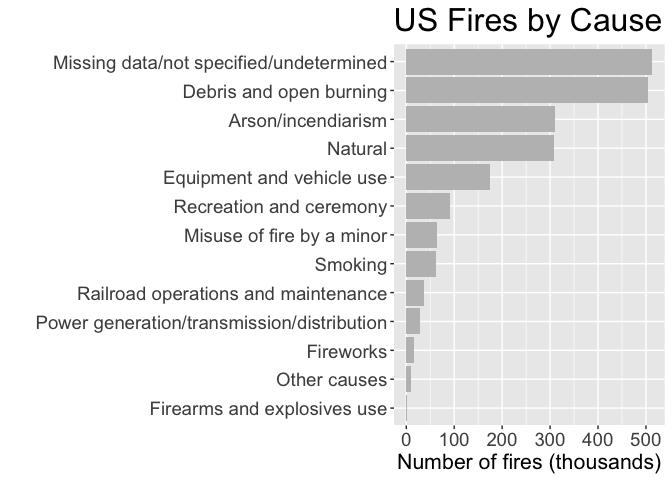

``` r
# CA Fires by cause
fires_new_ca %>%
    group_by(NWCG_GENERAL_CAUSE) %>%
    summarize(n_fires = n()/1000) %>%
    ggplot(aes(x = reorder(NWCG_GENERAL_CAUSE, n_fires), y = n_fires)) + geom_bar(stat = "identity",
    fill = "grey") + coord_flip() + labs(x = "", y = "Number of fires (thousands)",
    title = "CA Fires by Cause") + theme(title = element_text(size = 20), axis.title.x = element_text(size = 16),
    axis.text.x = element_text(size = 14), axis.text.y = element_text(size = 14))
```

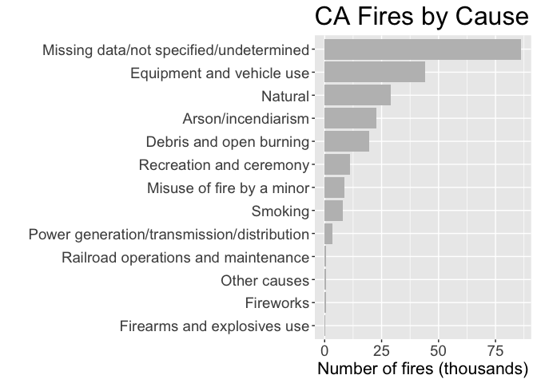

``` r
# West Fires by cause
fires_new_west %>%
    group_by(NWCG_GENERAL_CAUSE) %>%
    summarize(n_fires = n()/1000) %>%
    ggplot(aes(x = reorder(NWCG_GENERAL_CAUSE, n_fires), y = n_fires)) + geom_bar(stat = "identity",
    fill = "grey") + coord_flip() + labs(x = "", y = "Number of fires (thousands)",
    title = "West Fires by Cause") + theme(title = element_text(size = 20), axis.title.x = element_text(size = 16),
    axis.text.x = element_text(size = 14), axis.text.y = element_text(size = 14))
```

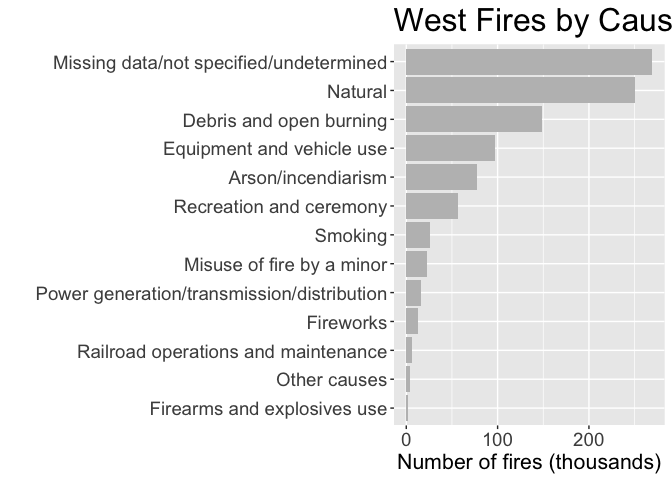

``` r
# East Fires by cause
fires_new_east %>%
    group_by(NWCG_GENERAL_CAUSE) %>%
    summarize(n_fires = n()/1000) %>%
    ggplot(aes(x = reorder(NWCG_GENERAL_CAUSE, n_fires), y = n_fires)) + geom_bar(stat = "identity",
    fill = "grey") + coord_flip() + labs(x = "", y = "Number of fires (thousands)",
    title = "East Fires by Cause") + theme(title = element_text(size = 20), axis.title.x = element_text(size = 16),
    axis.text.x = element_text(size = 14), axis.text.y = element_text(size = 14))
```

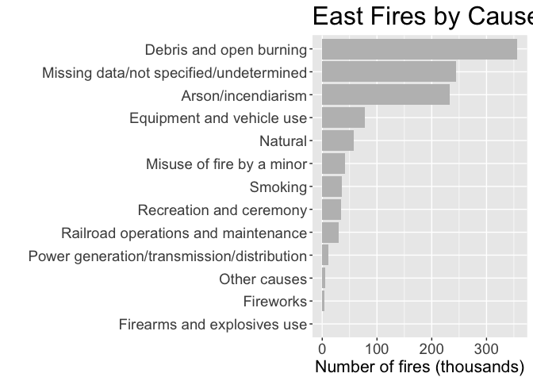

``` r
# US Fire Size by cause
fires_new %>%
    group_by(NWCG_GENERAL_CAUSE) %>%
    summarize(mean_size = mean(FIRE_SIZE, na.rm = TRUE)) %>%
    ggplot(aes(x = reorder(NWCG_GENERAL_CAUSE, mean_size), y = mean_size)) + geom_bar(stat = "identity",
    fill = "grey") + coord_flip() + labs(x = "", y = "Acres", title = "US Avg Fire Size by Cause") +
    theme(title = element_text(size = 20), axis.title.x = element_text(size = 16),
        axis.text.x = element_text(size = 14), axis.text.y = element_text(size = 14))
```

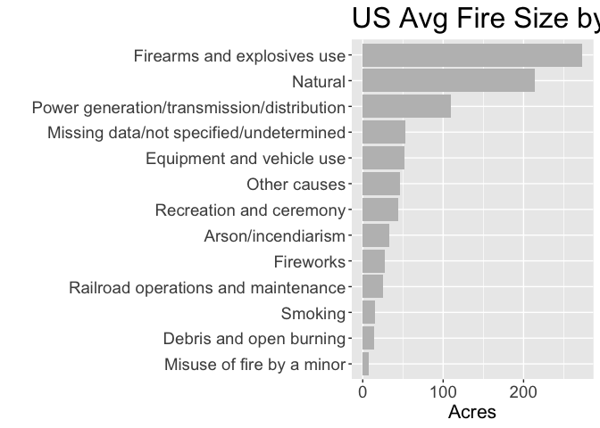

``` r
# CA Fire Size by cause
fires_new_ca %>%
    group_by(NWCG_GENERAL_CAUSE) %>%
    summarize(mean_size = mean(FIRE_SIZE, na.rm = TRUE)) %>%
    ggplot(aes(x = reorder(NWCG_GENERAL_CAUSE, mean_size), y = mean_size)) + geom_bar(stat = "identity",
    fill = "grey") + coord_flip() + labs(x = "", y = "Acres", title = "CA Avg Fire Size by Cause") +
    theme(title = element_text(size = 20), axis.title.x = element_text(size = 16),
        axis.text.x = element_text(size = 14), axis.text.y = element_text(size = 14))
```

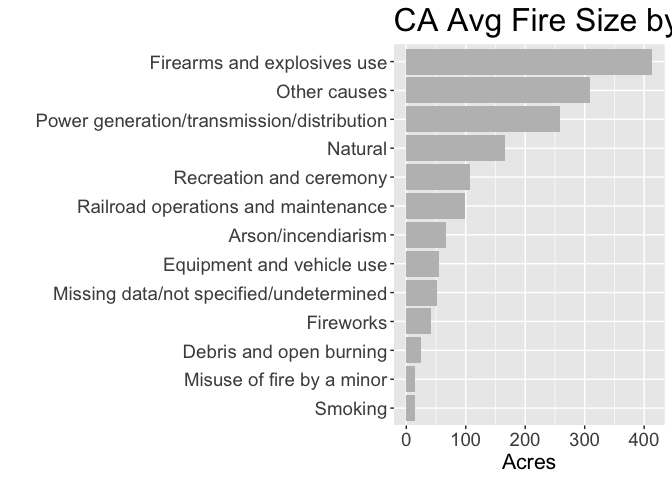

``` r
# West Fire Size by cause
fires_new_west %>%
    group_by(NWCG_GENERAL_CAUSE) %>%
    summarize(mean_size = mean(FIRE_SIZE, na.rm = TRUE)) %>%
    ggplot(aes(x = reorder(NWCG_GENERAL_CAUSE, mean_size), y = mean_size)) + geom_bar(stat = "identity",
    fill = "grey") + coord_flip() + labs(x = "", y = "Acres", title = "West Avg Fire Size by Cause") +
    theme(title = element_text(size = 20), axis.title.x = element_text(size = 16),
        axis.text.x = element_text(size = 14), axis.text.y = element_text(size = 14))
```

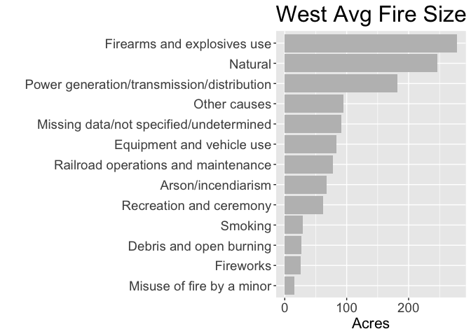

``` r
# East Fire Size by cause
fires_new_east %>%
    group_by(NWCG_GENERAL_CAUSE) %>%
    summarize(mean_size = mean(FIRE_SIZE, na.rm = TRUE)) %>%
    ggplot(aes(x = reorder(NWCG_GENERAL_CAUSE, mean_size), y = mean_size)) + geom_bar(stat = "identity",
    fill = "grey") + coord_flip() + labs(x = "", y = "Acres", title = "East Avg Fire Size by Cause") +
    theme(title = element_text(size = 20), axis.title.x = element_text(size = 16),
        axis.text.x = element_text(size = 14), axis.text.y = element_text(size = 14))
```

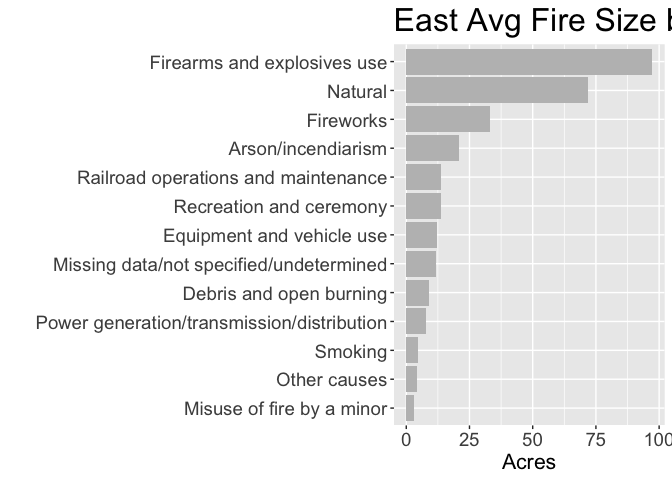

``` r
# US Days to cont by cause
fires_new %>%
    group_by(NWCG_GENERAL_CAUSE) %>%
    summarize(mean_days_to_cont = mean(DAYS_TO_CONT, na.rm = TRUE)) %>%
    ggplot(aes(x = reorder(NWCG_GENERAL_CAUSE, mean_days_to_cont), y = mean_days_to_cont)) +
    geom_bar(stat = "identity", fill = "grey") + coord_flip() + labs(x = "", y = "Days",
    title = "US Avg Days to Containment by Cause") + theme(title = element_text(size = 20),
    axis.title.x = element_text(size = 16), axis.text.x = element_text(size = 14),
    axis.text.y = element_text(size = 14))
```

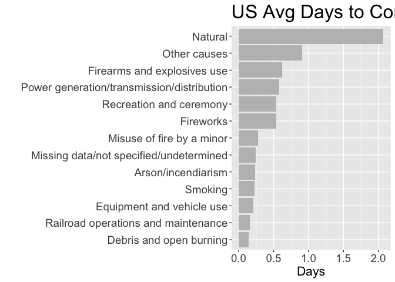

``` r
# CA Days to cont by cause
fires_new_ca %>%
    group_by(NWCG_GENERAL_CAUSE) %>%
    summarize(mean_days_to_cont = mean(DAYS_TO_CONT, na.rm = TRUE)) %>%
    ggplot(aes(x = reorder(NWCG_GENERAL_CAUSE, mean_days_to_cont), y = mean_days_to_cont)) +
    geom_bar(stat = "identity", fill = "grey") + coord_flip() + labs(x = "", y = "Days",
    title = "CA Avg Days to Containment by Cause") + theme(title = element_text(size = 20),
    axis.title.x = element_text(size = 16), axis.text.x = element_text(size = 14),
    axis.text.y = element_text(size = 14))
```

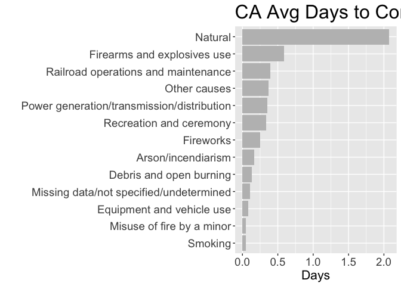

``` r
# West Days to cont by cause
fires_new_west %>%
    group_by(NWCG_GENERAL_CAUSE) %>%
    summarize(mean_days_to_cont = mean(DAYS_TO_CONT, na.rm = TRUE)) %>%
    ggplot(aes(x = reorder(NWCG_GENERAL_CAUSE, mean_days_to_cont), y = mean_days_to_cont)) +
    geom_bar(stat = "identity", fill = "grey") + coord_flip() + labs(x = "", y = "Days",
    title = "West Avg Days to Containment by Cause") + theme(title = element_text(size = 20),
    axis.title.x = element_text(size = 16), axis.text.x = element_text(size = 14),
    axis.text.y = element_text(size = 14))
```

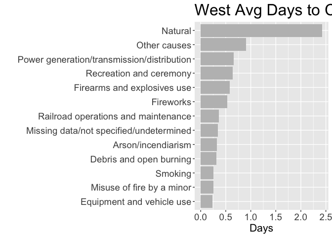

``` r
# East Days to cont by cause
fires_new_east %>%
    group_by(NWCG_GENERAL_CAUSE) %>%
    summarize(mean_days_to_cont = mean(DAYS_TO_CONT, na.rm = TRUE)) %>%
    ggplot(aes(x = reorder(NWCG_GENERAL_CAUSE, mean_days_to_cont), y = mean_days_to_cont)) +
    geom_bar(stat = "identity", fill = "grey") + coord_flip() + labs(x = "", y = "Days",
    title = "East Avg Days to Containment by Cause") + theme(title = element_text(size = 20),
    axis.title.x = element_text(size = 16), axis.text.x = element_text(size = 14),
    axis.text.y = element_text(size = 14))
```

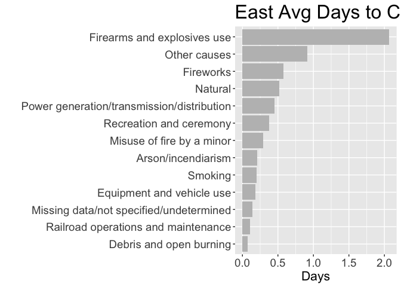
\## Correlation Matrix Numeric Attributes

``` r
# US fires
data(fires_new, package = "mosaicData")
df <- dplyr::select_if(fires_new, is.numeric)
r <- cor(df, use = "complete.obs")
round(r, 2)
```

    ##                DISCOVERY_TIME CONT_TIME FIRE_SIZE LATITUDE LONGITUDE
    ## DISCOVERY_TIME           1.00      0.59      0.00     0.00      0.06
    ## CONT_TIME                0.59      1.00      0.00    -0.03      0.03
    ## FIRE_SIZE                0.00      0.00      1.00     0.01     -0.03
    ## LATITUDE                 0.00     -0.03      0.01     1.00     -0.29
    ## LONGITUDE                0.06      0.03     -0.03    -0.29      1.00
    ## DAYS_TO_CONT             0.00     -0.07      0.16     0.10     -0.11
    ##                DAYS_TO_CONT
    ## DISCOVERY_TIME         0.00
    ## CONT_TIME             -0.07
    ## FIRE_SIZE              0.16
    ## LATITUDE               0.10
    ## LONGITUDE             -0.11
    ## DAYS_TO_CONT           1.00

``` r
ggcorrplot(r, hc.order = TRUE, type = "lower", lab = TRUE)
```

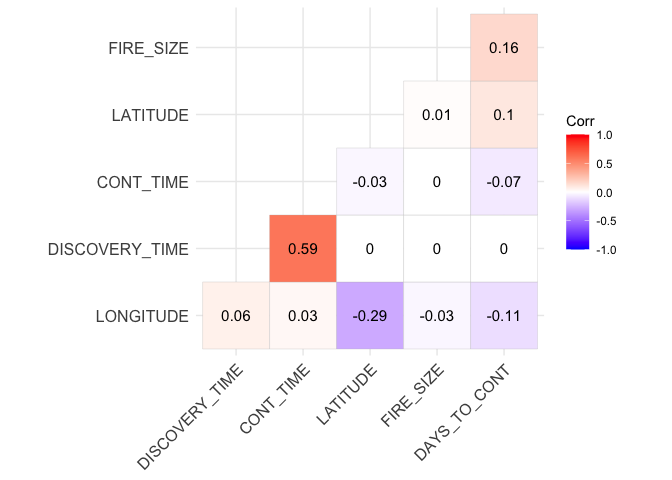

``` r
# CA fires
data(fires_new_ca, package = "mosaicData")
df <- dplyr::select_if(fires_new_ca, is.numeric)
r <- cor(df, use = "complete.obs")
round(r, 2)
```

    ##                DISCOVERY_TIME CONT_TIME FIRE_SIZE LATITUDE LONGITUDE
    ## DISCOVERY_TIME           1.00      0.65      0.00     0.00      0.00
    ## CONT_TIME                0.65      1.00      0.01     0.02      0.01
    ## FIRE_SIZE                0.00      0.01      1.00     0.00      0.00
    ## LATITUDE                 0.00      0.02      0.00     1.00     -0.88
    ## LONGITUDE                0.00      0.01      0.00    -0.88      1.00
    ## DAYS_TO_CONT             0.00     -0.02      0.22     0.05     -0.02
    ##                DAYS_TO_CONT
    ## DISCOVERY_TIME         0.00
    ## CONT_TIME             -0.02
    ## FIRE_SIZE              0.22
    ## LATITUDE               0.05
    ## LONGITUDE             -0.02
    ## DAYS_TO_CONT           1.00

``` r
ggcorrplot(r, hc.order = TRUE, type = "lower", lab = TRUE)
```


``` r
# West fires
data(fires_new_west, package = "mosaicData")
df <- dplyr::select_if(fires_new_west, is.numeric)
r <- cor(df, use = "complete.obs")
round(r, 2)
```

    ##                DISCOVERY_TIME CONT_TIME FIRE_SIZE LATITUDE LONGITUDE
    ## DISCOVERY_TIME           1.00      0.53      0.00     0.00      0.07
    ## CONT_TIME                0.53      1.00      0.01    -0.02      0.07
    ## FIRE_SIZE                0.00      0.01      1.00     0.01     -0.01
    ## LATITUDE                 0.00     -0.02      0.01     1.00     -0.25
    ## LONGITUDE                0.07      0.07     -0.01    -0.25      1.00
    ## DAYS_TO_CONT             0.01     -0.07      0.16     0.11     -0.08
    ##                DAYS_TO_CONT
    ## DISCOVERY_TIME         0.01
    ## CONT_TIME             -0.07
    ## FIRE_SIZE              0.16
    ## LATITUDE               0.11
    ## LONGITUDE             -0.08
    ## DAYS_TO_CONT           1.00

``` r
ggcorrplot(r, hc.order = TRUE, type = "lower", lab = TRUE)
```

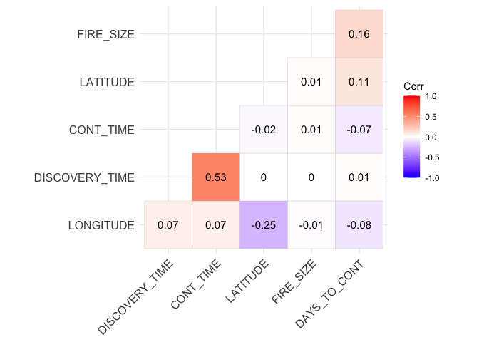

``` r
# East fires
data(fires_new_east, package = "mosaicData")
df <- dplyr::select_if(fires_new_east, is.numeric)
r <- cor(df, use = "complete.obs")
round(r, 2)
```

    ##                DISCOVERY_TIME CONT_TIME FIRE_SIZE LATITUDE LONGITUDE
    ## DISCOVERY_TIME           1.00      0.70      0.00     0.03      0.00
    ## CONT_TIME                0.70      1.00      0.00    -0.04     -0.09
    ## FIRE_SIZE                0.00      0.00      1.00    -0.02      0.00
    ## LATITUDE                 0.03     -0.04     -0.02     1.00      0.16
    ## LONGITUDE                0.00     -0.09      0.00     0.16      1.00
    ## DAYS_TO_CONT             0.01     -0.09      0.14     0.02      0.06
    ##                DAYS_TO_CONT
    ## DISCOVERY_TIME         0.01
    ## CONT_TIME             -0.09
    ## FIRE_SIZE              0.14
    ## LATITUDE               0.02
    ## LONGITUDE              0.06
    ## DAYS_TO_CONT           1.00

``` r
ggcorrplot(r, hc.order = TRUE, type = "lower", lab = TRUE)
```

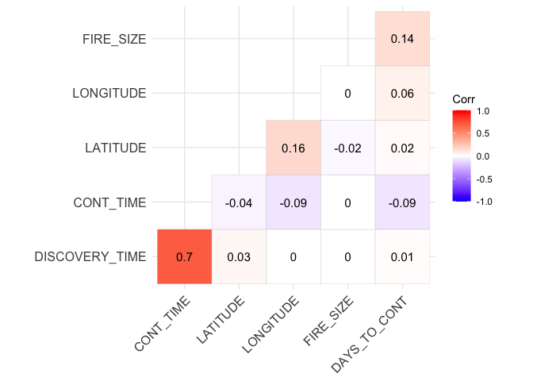
\## Fire size and SPEI Linear Regression

``` r
# CA FIRE_SIZE & SPEI new df with fire_year and mean fire size for CA
fires_new_ca_fs <- fires_new_ca %>%
    group_by(FIRE_YEAR) %>%
    summarise_at(vars(FIRE_SIZE), list(AVG_FIRE_SIZE_CA = mean))

fires_new_ca_fs
```

    ## # A tibble: 27 × 2
    ##    FIRE_YEAR AVG_FIRE_SIZE_CA
    ##    <fct>                <dbl>
    ##  1 1992                  27.4
    ##  2 1993                  38.9
    ##  3 1994                  47.1
    ##  4 1995                  29.3
    ##  5 1996                  77.1
    ##  6 1997                  40.9
    ##  7 1998                  23.3
    ##  8 1999                  90.3
    ##  9 2000                  38.0
    ## 10 2001                  42.9
    ## # … with 17 more rows

``` r
# rename fire_year for merging
fires_new_ca_fs <- rename_all(fires_new_ca_fs, recode, FIRE_YEAR = "Year")
fires_new_ca_fs
```

    ## # A tibble: 27 × 2
    ##    Year  AVG_FIRE_SIZE_CA
    ##    <fct>            <dbl>
    ##  1 1992              27.4
    ##  2 1993              38.9
    ##  3 1994              47.1
    ##  4 1995              29.3
    ##  5 1996              77.1
    ##  6 1997              40.9
    ##  7 1998              23.3
    ##  8 1999              90.3
    ##  9 2000              38.0
    ## 10 2001              42.9
    ## # … with 17 more rows

``` r
# merge with Ca-spei
ca_fs_spei <- merge(fires_new_ca_fs, ca_SPEI, by = "Year", all = TRUE)
ca_fs_spei
```

    ##    Year AVG_FIRE_SIZE_CA CA_5yr_SPEI
    ## 1  1992               27       -1.19
    ## 2  1993               39       -0.52
    ## 3  1994               47       -0.81
    ## 4  1995               29        0.28
    ## 5  1996               77        0.36
    ## 6  1997               41        0.60
    ## 7  1998               23        0.96
    ## 8  1999               90        1.25
    ## 9  2000               38        0.67
    ## 10 2001               43        0.33
    ## 11 2002               72       -0.05
    ## 12 2003              131       -0.98
    ## 13 2004               41       -1.04
    ## 14 2005               26       -0.73
    ## 15 2006               68       -0.16
    ## 16 2007               79       -0.26
    ## 17 2008              135       -0.53
    ## 18 2009               47       -0.74
    ## 19 2010               15       -0.80
    ## 20 2011               22       -0.60
    ## 21 2012              106       -0.56
    ## 22 2013               67       -0.61
    ## 23 2014               84       -1.03
    ## 24 2015              115       -1.65
    ## 25 2016               73       -1.93
    ## 26 2017              143       -1.38
    ## 27 2018              172       -1.45
    ## 28 2019               NA       -0.61
    ## 29 2020               NA       -0.61
    ## 30 2021               NA       -1.10

``` r
# linear regression
fit1 <- lm(AVG_FIRE_SIZE_CA ~ CA_5yr_SPEI, data = ca_fs_spei)
summary(fit1)
```

    ## 
    ## Call:
    ## lm(formula = AVG_FIRE_SIZE_CA ~ CA_5yr_SPEI, data = ca_fs_spei)
    ## 
    ## Residuals:
    ##    Min     1Q Median     3Q    Max 
    ## -59.49 -27.31  -7.73  24.24  85.33 
    ## 
    ## Coefficients:
    ##             Estimate Std. Error t value   Pr(>|t|)    
    ## (Intercept)    59.91       8.97    6.68 0.00000053 ***
    ## CA_5yr_SPEI   -18.74       9.79   -1.91      0.067 .  
    ## ---
    ## Signif. codes:  0 '***' 0.001 '**' 0.01 '*' 0.05 '.' 0.1 ' ' 1
    ## 
    ## Residual standard error: 40 on 25 degrees of freedom
    ##   (3 observations deleted due to missingness)
    ## Multiple R-squared:  0.128,  Adjusted R-squared:  0.0928 
    ## F-statistic: 3.66 on 1 and 25 DF,  p-value: 0.0672

``` r
# Linear regression func for values to show on visual
ggplotRegression <- function(fit) {

    require(ggplot2)

    ggplot(fit$model, aes_string(x = names(fit$model)[2], y = names(fit$model)[1])) +
        geom_point() + stat_smooth(method = "lm", col = "red") + labs(title = paste("Adj R2 = ",
        signif(summary(fit)$adj.r.squared, 5), "Intercept =", signif(fit$coef[[1]],
            5), " Slope =", signif(fit$coef[[2]], 5), " P =", signif(summary(fit)$coef[2,
            4], 5)))
}

ggplotRegression(fit1)
```

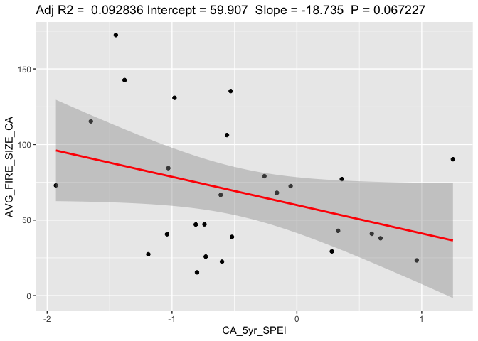

``` r
# normalize FIRE_SIZE_CA
ca_fs_spei_norm <- ca_fs_spei %>%
    mutate_at(c("AVG_FIRE_SIZE_CA"), ~(scale(.) %>%
        as.vector))
ca_fs_spei_norm
```

    ##    Year AVG_FIRE_SIZE_CA CA_5yr_SPEI
    ## 1  1992           -0.979       -1.19
    ## 2  1993           -0.706       -0.52
    ## 3  1994           -0.512       -0.81
    ## 4  1995           -0.934        0.28
    ## 5  1996            0.201        0.36
    ## 6  1997           -0.657        0.60
    ## 7  1998           -1.075        0.96
    ## 8  1999            0.513        1.25
    ## 9  2000           -0.727        0.67
    ## 10 2001           -0.611        0.33
    ## 11 2002            0.091       -0.05
    ## 12 2003            1.478       -0.98
    ## 13 2004           -0.665       -1.04
    ## 14 2005           -1.016       -0.73
    ## 15 2006           -0.014       -0.16
    ## 16 2007            0.247       -0.26
    ## 17 2008            1.583       -0.53
    ## 18 2009           -0.509       -0.74
    ## 19 2010           -1.263       -0.80
    ## 20 2011           -1.096       -0.60
    ## 21 2012            0.893       -0.56
    ## 22 2013           -0.047       -0.61
    ## 23 2014            0.374       -1.03
    ## 24 2015            1.109       -1.65
    ## 25 2016            0.102       -1.93
    ## 26 2017            1.756       -1.38
    ## 27 2018            2.463       -1.45
    ## 28 2019               NA       -0.61
    ## 29 2020               NA       -0.61
    ## 30 2021               NA       -1.10

``` r
fit2 <- lm(AVG_FIRE_SIZE_CA ~ CA_5yr_SPEI, data = ca_fs_spei_norm)
summary(fit2)
```

    ## 
    ## Call:
    ## lm(formula = AVG_FIRE_SIZE_CA ~ CA_5yr_SPEI, data = ca_fs_spei_norm)
    ## 
    ## Residuals:
    ##    Min     1Q Median     3Q    Max 
    ## -1.412 -0.648 -0.183  0.575  2.025 
    ## 
    ## Coefficients:
    ##             Estimate Std. Error t value Pr(>|t|)  
    ## (Intercept)   -0.207      0.213   -0.97    0.340  
    ## CA_5yr_SPEI   -0.445      0.232   -1.91    0.067 .
    ## ---
    ## Signif. codes:  0 '***' 0.001 '**' 0.01 '*' 0.05 '.' 0.1 ' ' 1
    ## 
    ## Residual standard error: 0.95 on 25 degrees of freedom
    ##   (3 observations deleted due to missingness)
    ## Multiple R-squared:  0.128,  Adjusted R-squared:  0.0928 
    ## F-statistic: 3.66 on 1 and 25 DF,  p-value: 0.0672

``` r
ggplotRegression(fit2)
```

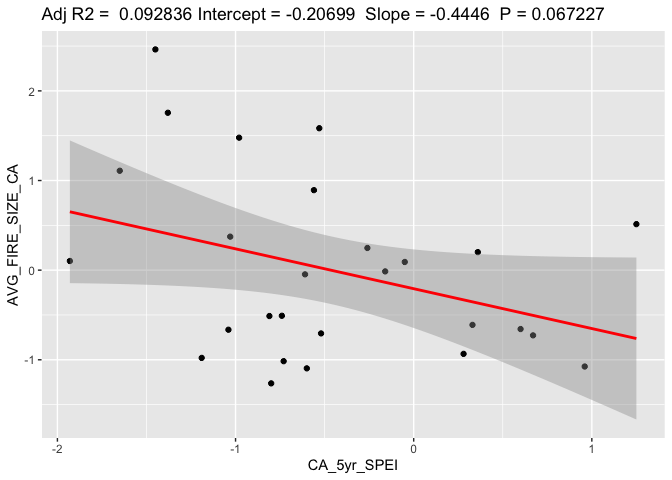

``` r
# normalization gives same result
```

## Fire frequency and SPEI Linear Regression

``` r
# CA FIRE_FREQ & SPEI new df with fire_year and fire frequency for CA
fires_new_ca_ff <- fires_new_ca %>%
    group_by(FIRE_YEAR) %>%
    summarise(CA_FIRE_FREQ = (count = n()))

fires_new_ca_ff
```

    ## # A tibble: 27 × 2
    ##    FIRE_YEAR CA_FIRE_FREQ
    ##    <fct>            <int>
    ##  1 1992             10831
    ##  2 1993              8268
    ##  3 1994              8649
    ##  4 1995              7381
    ##  5 1996              9170
    ##  6 1997              7928
    ##  7 1998              6861
    ##  8 1999              8909
    ##  9 2000              6970
    ## 10 2001              8163
    ## # … with 17 more rows

``` r
# rename fire_year for merging
fires_new_ca_ff <- rename_all(fires_new_ca_ff, recode, FIRE_YEAR = "Year")
fires_new_ca_ff
```

    ## # A tibble: 27 × 2
    ##    Year  CA_FIRE_FREQ
    ##    <fct>        <int>
    ##  1 1992         10831
    ##  2 1993          8268
    ##  3 1994          8649
    ##  4 1995          7381
    ##  5 1996          9170
    ##  6 1997          7928
    ##  7 1998          6861
    ##  8 1999          8909
    ##  9 2000          6970
    ## 10 2001          8163
    ## # … with 17 more rows

``` r
# merge with Ca-spei
ca_ff_spei <- merge(fires_new_ca_ff, ca_SPEI, by = "Year", all = TRUE)
ca_ff_spei
```

    ##    Year CA_FIRE_FREQ CA_5yr_SPEI
    ## 1  1992        10831       -1.19
    ## 2  1993         8268       -0.52
    ## 3  1994         8649       -0.81
    ## 4  1995         7381        0.28
    ## 5  1996         9170        0.36
    ## 6  1997         7928        0.60
    ## 7  1998         6861        0.96
    ## 8  1999         8909        1.25
    ## 9  2000         6970        0.67
    ## 10 2001         8163        0.33
    ## 11 2002         7118       -0.05
    ## 12 2003         7894       -0.98
    ## 13 2004         7407       -1.04
    ## 14 2005        10219       -0.73
    ## 15 2006        12038       -0.16
    ## 16 2007        13428       -0.26
    ## 17 2008        10594       -0.53
    ## 18 2009         9862       -0.74
    ## 19 2010         8304       -0.80
    ## 20 2011         8560       -0.60
    ## 21 2012         7198       -0.56
    ## 22 2013         8722       -0.61
    ## 23 2014         6493       -1.03
    ## 24 2015         7355       -1.65
    ## 25 2016         7882       -1.93
    ## 26 2017         9537       -1.38
    ## 27 2018         9488       -1.45
    ## 28 2019           NA       -0.61
    ## 29 2020           NA       -0.61
    ## 30 2021           NA       -1.10

``` r
# linear regression
fit3 <- lm(CA_FIRE_FREQ ~ CA_5yr_SPEI, data = ca_ff_spei)
summary(fit3)
```

    ## 
    ## Call:
    ## lm(formula = CA_FIRE_FREQ ~ CA_5yr_SPEI, data = ca_ff_spei)
    ## 
    ## Residuals:
    ##    Min     1Q Median     3Q    Max 
    ##  -2325  -1302   -400    633   4754 
    ## 
    ## Coefficients:
    ##             Estimate Std. Error t value            Pr(>|t|)    
    ## (Intercept)     8625        374   23.05 <0.0000000000000002 ***
    ## CA_5yr_SPEI     -187        408   -0.46                0.65    
    ## ---
    ## Signif. codes:  0 '***' 0.001 '**' 0.01 '*' 0.05 '.' 0.1 ' ' 1
    ## 
    ## Residual standard error: 1670 on 25 degrees of freedom
    ##   (3 observations deleted due to missingness)
    ## Multiple R-squared:  0.00831,    Adjusted R-squared:  -0.0314 
    ## F-statistic: 0.209 on 1 and 25 DF,  p-value: 0.651

``` r
ggplotRegression(fit3)
```

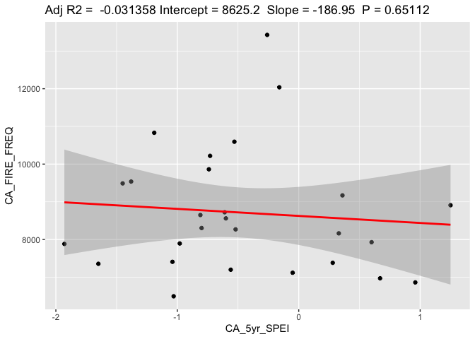
\## Fire area and SPEI Linear Regression

``` r
# CA FIRE_AREA & SPEI new df with fire_year and fire area for CA
fires_new_ca_fa <- fires_new_ca %>%
    group_by(FIRE_YEAR) %>%
    summarise_at(vars(FIRE_SIZE), list(AREA_BURNED_CA = sum))

fires_new_ca_fa
```

    ## # A tibble: 27 × 2
    ##    FIRE_YEAR AREA_BURNED_CA
    ##    <fct>              <dbl>
    ##  1 1992             296440.
    ##  2 1993             321495.
    ##  3 1994             406965.
    ##  4 1995             216069.
    ##  5 1996             707109.
    ##  6 1997             324566.
    ##  7 1998             160009.
    ##  8 1999             804123.
    ##  9 2000             264671.
    ## 10 2001             350140.
    ## # … with 17 more rows

``` r
# rename fire_year for merging
fires_new_ca_fa <- rename_all(fires_new_ca_fa, recode, FIRE_YEAR = "Year")
fires_new_ca_fa
```

    ## # A tibble: 27 × 2
    ##    Year  AREA_BURNED_CA
    ##    <fct>          <dbl>
    ##  1 1992         296440.
    ##  2 1993         321495.
    ##  3 1994         406965.
    ##  4 1995         216069.
    ##  5 1996         707109.
    ##  6 1997         324566.
    ##  7 1998         160009.
    ##  8 1999         804123.
    ##  9 2000         264671.
    ## 10 2001         350140.
    ## # … with 17 more rows

``` r
# merge with Ca-spei
ca_fa_spei <- merge(fires_new_ca_fa, ca_SPEI, by = "Year", all = TRUE)
ca_fa_spei
```

    ##    Year AREA_BURNED_CA CA_5yr_SPEI
    ## 1  1992         296440       -1.19
    ## 2  1993         321495       -0.52
    ## 3  1994         406965       -0.81
    ## 4  1995         216069        0.28
    ## 5  1996         707109        0.36
    ## 6  1997         324566        0.60
    ## 7  1998         160009        0.96
    ## 8  1999         804123        1.25
    ## 9  2000         264671        0.67
    ## 10 2001         350140        0.33
    ## 11 2002         515860       -0.05
    ## 12 2003        1033343       -0.98
    ## 13 2004         300885       -1.04
    ## 14 2005         263962       -0.73
    ## 15 2006         819106       -0.16
    ## 16 2007        1061554       -0.26
    ## 17 2008        1433971       -0.53
    ## 18 2009         465219       -0.74
    ## 19 2010         127905       -0.80
    ## 20 2011         192278       -0.60
    ## 21 2012         764759       -0.56
    ## 22 2013         581410       -0.61
    ## 23 2014         547829       -1.03
    ## 24 2015         848438       -1.65
    ## 25 2016         574863       -1.93
    ## 26 2017        1360160       -1.38
    ## 27 2018        1635758       -1.45
    ## 28 2019             NA       -0.61
    ## 29 2020             NA       -0.61
    ## 30 2021             NA       -1.10

``` r
# linear regression
fit4 <- lm(AREA_BURNED_CA ~ CA_5yr_SPEI, data = ca_fa_spei)
summary(fit4)
```

    ## 
    ## Call:
    ## lm(formula = AREA_BURNED_CA ~ CA_5yr_SPEI, data = ca_fa_spei)
    ## 
    ## Residuals:
    ##     Min      1Q  Median      3Q     Max 
    ## -531303 -267673 -131405  245401  874354 
    ## 
    ## Coefficients:
    ##             Estimate Std. Error t value  Pr(>|t|)    
    ## (Intercept)   533429      88710    6.01 0.0000028 ***
    ## CA_5yr_SPEI  -157224      96850   -1.62      0.12    
    ## ---
    ## Signif. codes:  0 '***' 0.001 '**' 0.01 '*' 0.05 '.' 0.1 ' ' 1
    ## 
    ## Residual standard error: 397000 on 25 degrees of freedom
    ##   (3 observations deleted due to missingness)
    ## Multiple R-squared:  0.0954, Adjusted R-squared:  0.0592 
    ## F-statistic: 2.64 on 1 and 25 DF,  p-value: 0.117

``` r
ggplotRegression(fit4)
```

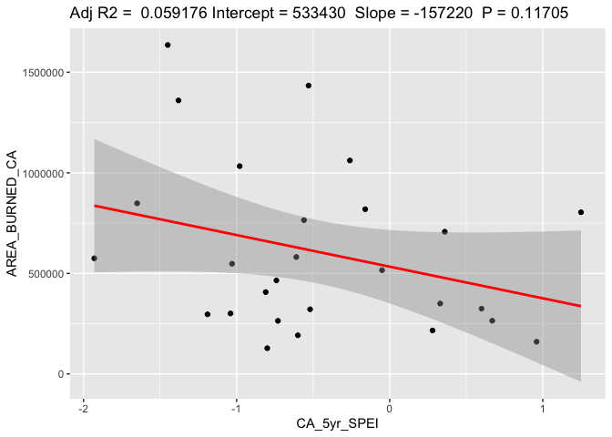
\## Large Fires and SPEI Linear Regression

``` r
# Number of fires greater than 10,000 acres and the proportion Large fire
# defined as > 10,000 in literature here:
# (https://fireecology.springeropen.com/articles/10.1186/s42408-021-00110-7)
fires_new_ca_lf <- fires_new_ca %>%
    group_by(FIRE_YEAR) %>%
    summarize(CA_NUM_FIRES = n(), CA_NUM_LARGE_FIRES = sum(FIRE_SIZE > 10000), CA_PCT_LARGE_FIRES = (CA_NUM_LARGE_FIRES/CA_NUM_FIRES) *
        100)
fires_new_ca_lf
```

    ## # A tibble: 27 × 4
    ##    FIRE_YEAR CA_NUM_FIRES CA_NUM_LARGE_FIRES CA_PCT_LARGE_FIRES
    ##    <fct>            <int>              <int>              <dbl>
    ##  1 1992             10831                  3             0.0277
    ##  2 1993              8268                  6             0.0726
    ##  3 1994              8649                  6             0.0694
    ##  4 1995              7381                  2             0.0271
    ##  5 1996              9170                 14             0.153 
    ##  6 1997              7928                  6             0.0757
    ##  7 1998              6861                  2             0.0292
    ##  8 1999              8909                 18             0.202 
    ##  9 2000              6970                  3             0.0430
    ## 10 2001              8163                  8             0.0980
    ## # … with 17 more rows

``` r
# rename fire_year for merging
fires_new_ca_lf <- rename_all(fires_new_ca_lf, recode, FIRE_YEAR = "Year")
fires_new_ca_lf
```

    ## # A tibble: 27 × 4
    ##    Year  CA_NUM_FIRES CA_NUM_LARGE_FIRES CA_PCT_LARGE_FIRES
    ##    <fct>        <int>              <int>              <dbl>
    ##  1 1992         10831                  3             0.0277
    ##  2 1993          8268                  6             0.0726
    ##  3 1994          8649                  6             0.0694
    ##  4 1995          7381                  2             0.0271
    ##  5 1996          9170                 14             0.153 
    ##  6 1997          7928                  6             0.0757
    ##  7 1998          6861                  2             0.0292
    ##  8 1999          8909                 18             0.202 
    ##  9 2000          6970                  3             0.0430
    ## 10 2001          8163                  8             0.0980
    ## # … with 17 more rows

``` r
# merge with Ca-spei
ca_lf_spei <- merge(fires_new_ca_lf, ca_SPEI, by = "Year", all = TRUE)
ca_lf_spei
```

    ##    Year CA_NUM_FIRES CA_NUM_LARGE_FIRES CA_PCT_LARGE_FIRES CA_5yr_SPEI
    ## 1  1992        10831                  3              0.028       -1.19
    ## 2  1993         8268                  6              0.073       -0.52
    ## 3  1994         8649                  6              0.069       -0.81
    ## 4  1995         7381                  2              0.027        0.28
    ## 5  1996         9170                 14              0.153        0.36
    ## 6  1997         7928                  6              0.076        0.60
    ## 7  1998         6861                  2              0.029        0.96
    ## 8  1999         8909                 18              0.202        1.25
    ## 9  2000         6970                  3              0.043        0.67
    ## 10 2001         8163                  8              0.098        0.33
    ## 11 2002         7118                  7              0.098       -0.05
    ## 12 2003         7894                 14              0.177       -0.98
    ## 13 2004         7407                  8              0.108       -1.04
    ## 14 2005        10219                  3              0.029       -0.73
    ## 15 2006        12038                 16              0.133       -0.16
    ## 16 2007        13428                 14              0.104       -0.26
    ## 17 2008        10594                 38              0.359       -0.53
    ## 18 2009         9862                  4              0.041       -0.74
    ## 19 2010         8304                  2              0.024       -0.80
    ## 20 2011         8560                  4              0.047       -0.60
    ## 21 2012         7198                 12              0.167       -0.56
    ## 22 2013         8722                 11              0.126       -0.61
    ## 23 2014         6493                 12              0.185       -1.03
    ## 24 2015         7355                 17              0.231       -1.65
    ## 25 2016         7882                 10              0.127       -1.93
    ## 26 2017         9537                 25              0.262       -1.38
    ## 27 2018         9488                 21              0.221       -1.45
    ## 28 2019           NA                 NA                 NA       -0.61
    ## 29 2020           NA                 NA                 NA       -0.61
    ## 30 2021           NA                 NA                 NA       -1.10

``` r
# linear regression
fit5 <- lm(CA_PCT_LARGE_FIRES ~ CA_5yr_SPEI, data = ca_lf_spei)
summary(fit5)
```

    ## 
    ## Call:
    ## lm(formula = CA_PCT_LARGE_FIRES ~ CA_5yr_SPEI, data = ca_lf_spei)
    ## 
    ## Residuals:
    ##      Min       1Q   Median       3Q      Max 
    ## -0.11237 -0.05555 -0.00996  0.04670  0.23702 
    ## 
    ## Coefficients:
    ##             Estimate Std. Error t value  Pr(>|t|)    
    ## (Intercept)   0.1069     0.0186    5.75 0.0000054 ***
    ## CA_5yr_SPEI  -0.0279     0.0203   -1.37      0.18    
    ## ---
    ## Signif. codes:  0 '***' 0.001 '**' 0.01 '*' 0.05 '.' 0.1 ' ' 1
    ## 
    ## Residual standard error: 0.083 on 25 degrees of freedom
    ##   (3 observations deleted due to missingness)
    ## Multiple R-squared:  0.0701, Adjusted R-squared:  0.0329 
    ## F-statistic: 1.89 on 1 and 25 DF,  p-value: 0.182

``` r
ggplotRegression(fit5)
```

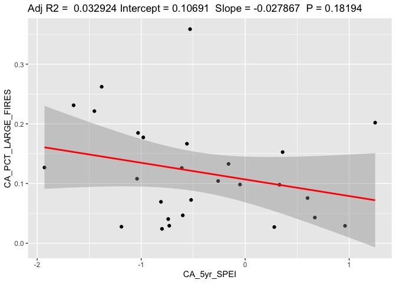
\## Multiple Linear Regression

``` r
# merge fa,fs,lf
ca_fa_lf_SPEI <- merge(fires_new_ca_fa, ca_lf_spei, by = "Year", all = TRUE)
ca_combined_SPEI <- merge(fires_new_ca_fs, ca_fa_lf_SPEI, by = "Year", all = TRUE)
ca_combined_SPEI
```

    ##    Year AVG_FIRE_SIZE_CA AREA_BURNED_CA CA_NUM_FIRES CA_NUM_LARGE_FIRES
    ## 1  1992               27         296440        10831                  3
    ## 2  1993               39         321495         8268                  6
    ## 3  1994               47         406965         8649                  6
    ## 4  1995               29         216069         7381                  2
    ## 5  1996               77         707109         9170                 14
    ## 6  1997               41         324566         7928                  6
    ## 7  1998               23         160009         6861                  2
    ## 8  1999               90         804123         8909                 18
    ## 9  2000               38         264671         6970                  3
    ## 10 2001               43         350140         8163                  8
    ## 11 2002               72         515860         7118                  7
    ## 12 2003              131        1033343         7894                 14
    ## 13 2004               41         300885         7407                  8
    ## 14 2005               26         263962        10219                  3
    ## 15 2006               68         819106        12038                 16
    ## 16 2007               79        1061554        13428                 14
    ## 17 2008              135        1433971        10594                 38
    ## 18 2009               47         465219         9862                  4
    ## 19 2010               15         127905         8304                  2
    ## 20 2011               22         192278         8560                  4
    ## 21 2012              106         764759         7198                 12
    ## 22 2013               67         581410         8722                 11
    ## 23 2014               84         547829         6493                 12
    ## 24 2015              115         848438         7355                 17
    ## 25 2016               73         574863         7882                 10
    ## 26 2017              143        1360160         9537                 25
    ## 27 2018              172        1635758         9488                 21
    ## 28 2019               NA             NA           NA                 NA
    ## 29 2020               NA             NA           NA                 NA
    ## 30 2021               NA             NA           NA                 NA
    ##    CA_PCT_LARGE_FIRES CA_5yr_SPEI
    ## 1               0.028       -1.19
    ## 2               0.073       -0.52
    ## 3               0.069       -0.81
    ## 4               0.027        0.28
    ## 5               0.153        0.36
    ## 6               0.076        0.60
    ## 7               0.029        0.96
    ## 8               0.202        1.25
    ## 9               0.043        0.67
    ## 10              0.098        0.33
    ## 11              0.098       -0.05
    ## 12              0.177       -0.98
    ## 13              0.108       -1.04
    ## 14              0.029       -0.73
    ## 15              0.133       -0.16
    ## 16              0.104       -0.26
    ## 17              0.359       -0.53
    ## 18              0.041       -0.74
    ## 19              0.024       -0.80
    ## 20              0.047       -0.60
    ## 21              0.167       -0.56
    ## 22              0.126       -0.61
    ## 23              0.185       -1.03
    ## 24              0.231       -1.65
    ## 25              0.127       -1.93
    ## 26              0.262       -1.38
    ## 27              0.221       -1.45
    ## 28                 NA       -0.61
    ## 29                 NA       -0.61
    ## 30                 NA       -1.10

``` r
# ca_combined_SPEI correlation
data(ca_combined_SPEI, package = "mosaicData")
df <- dplyr::select_if(ca_combined_SPEI, is.numeric)
r <- cor(df, use = "complete.obs")
round(r, 2)
```

    ##                    AVG_FIRE_SIZE_CA AREA_BURNED_CA CA_NUM_FIRES
    ## AVG_FIRE_SIZE_CA               1.00           0.95         0.13
    ## AREA_BURNED_CA                 0.95           1.00         0.40
    ## CA_NUM_FIRES                   0.13           0.40         1.00
    ## CA_NUM_LARGE_FIRES             0.85           0.90         0.33
    ## CA_PCT_LARGE_FIRES             0.90           0.86         0.11
    ## CA_5yr_SPEI                   -0.36          -0.31        -0.09
    ##                    CA_NUM_LARGE_FIRES CA_PCT_LARGE_FIRES CA_5yr_SPEI
    ## AVG_FIRE_SIZE_CA                 0.85               0.90       -0.36
    ## AREA_BURNED_CA                   0.90               0.86       -0.31
    ## CA_NUM_FIRES                     0.33               0.11       -0.09
    ## CA_NUM_LARGE_FIRES               1.00               0.96       -0.21
    ## CA_PCT_LARGE_FIRES               0.96               1.00       -0.26
    ## CA_5yr_SPEI                     -0.21              -0.26        1.00

``` r
ggcorrplot(r, hc.order = TRUE, type = "lower", lab = TRUE)
```

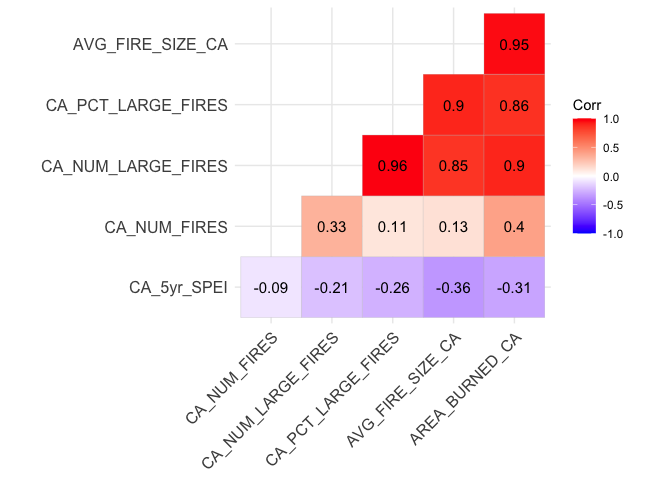

``` r
# Multiple Linear Regression
model <- lm(CA_5yr_SPEI ~ AVG_FIRE_SIZE_CA + AREA_BURNED_CA + CA_NUM_FIRES + CA_NUM_LARGE_FIRES +
    CA_PCT_LARGE_FIRES, data = ca_combined_SPEI)
print(model)
```

    ## 
    ## Call:
    ## lm(formula = CA_5yr_SPEI ~ AVG_FIRE_SIZE_CA + AREA_BURNED_CA + 
    ##     CA_NUM_FIRES + CA_NUM_LARGE_FIRES + CA_PCT_LARGE_FIRES, data = ca_combined_SPEI)
    ## 
    ## Coefficients:
    ##        (Intercept)    AVG_FIRE_SIZE_CA      AREA_BURNED_CA        CA_NUM_FIRES  
    ##         3.22289995         -0.01449452          0.00000088         -0.00036370  
    ## CA_NUM_LARGE_FIRES  CA_PCT_LARGE_FIRES  
    ##         0.23928900        -21.63298553

``` r
summary(model)
```

    ## 
    ## Call:
    ## lm(formula = CA_5yr_SPEI ~ AVG_FIRE_SIZE_CA + AREA_BURNED_CA + 
    ##     CA_NUM_FIRES + CA_NUM_LARGE_FIRES + CA_PCT_LARGE_FIRES, data = ca_combined_SPEI)
    ## 
    ## Residuals:
    ##    Min     1Q Median     3Q    Max 
    ## -1.383 -0.477 -0.110  0.475  1.932 
    ## 
    ## Coefficients:
    ##                        Estimate   Std. Error t value Pr(>|t|)
    ## (Intercept)          3.22289995   2.14590187    1.50     0.15
    ## AVG_FIRE_SIZE_CA    -0.01449452   0.05925187   -0.24     0.81
    ## AREA_BURNED_CA       0.00000088   0.00000649    0.14     0.89
    ## CA_NUM_FIRES        -0.00036370   0.00024626   -1.48     0.15
    ## CA_NUM_LARGE_FIRES   0.23928900   0.27895819    0.86     0.40
    ## CA_PCT_LARGE_FIRES -21.63298553  26.62606936   -0.81     0.43
    ## 
    ## Residual standard error: 0.75 on 21 degrees of freedom
    ##   (3 observations deleted due to missingness)
    ## Multiple R-squared:  0.29,   Adjusted R-squared:  0.121 
    ## F-statistic: 1.71 on 5 and 21 DF,  p-value: 0.175

``` r
# Get the Intercept and coefficients as vector elements.
cat("# # # # The Coefficient Values # # # ", "\n")
```

    ## # # # # The Coefficient Values # # #

``` r
a <- coef(model)[1]
print(a)
```

    ## (Intercept) 
    ##         3.2

``` r
XAVG_FIRE_SIZE_CA <- coef(model)[2]
XAREA_BURNED_CA <- coef(model)[3]
XCA_NUM_FIRES <- coef(model)[4]
XCA_NUM_LARGE_FIRES <- coef(model)[5]
XCA_PCT_LARGE_FIRES <- coef(model)[6]
print(XAVG_FIRE_SIZE_CA)
```

    ## AVG_FIRE_SIZE_CA 
    ##           -0.014

``` r
print(XAREA_BURNED_CA)
```

    ## AREA_BURNED_CA 
    ##     0.00000088

``` r
print(XCA_NUM_FIRES)
```

    ## CA_NUM_FIRES 
    ##     -0.00036

``` r
print(XCA_NUM_LARGE_FIRES)
```

    ## CA_NUM_LARGE_FIRES 
    ##               0.24

``` r
print(XCA_PCT_LARGE_FIRES)
```

    ## CA_PCT_LARGE_FIRES 
    ##                -22

## CA AVG_FIRE_SIZE Prediction

``` r
# Use 2019 - 2021 ca_SPEI values to predict avg fire size
ca_fs_spei
```

    ##    Year AVG_FIRE_SIZE_CA CA_5yr_SPEI
    ## 1  1992               27       -1.19
    ## 2  1993               39       -0.52
    ## 3  1994               47       -0.81
    ## 4  1995               29        0.28
    ## 5  1996               77        0.36
    ## 6  1997               41        0.60
    ## 7  1998               23        0.96
    ## 8  1999               90        1.25
    ## 9  2000               38        0.67
    ## 10 2001               43        0.33
    ## 11 2002               72       -0.05
    ## 12 2003              131       -0.98
    ## 13 2004               41       -1.04
    ## 14 2005               26       -0.73
    ## 15 2006               68       -0.16
    ## 16 2007               79       -0.26
    ## 17 2008              135       -0.53
    ## 18 2009               47       -0.74
    ## 19 2010               15       -0.80
    ## 20 2011               22       -0.60
    ## 21 2012              106       -0.56
    ## 22 2013               67       -0.61
    ## 23 2014               84       -1.03
    ## 24 2015              115       -1.65
    ## 25 2016               73       -1.93
    ## 26 2017              143       -1.38
    ## 27 2018              172       -1.45
    ## 28 2019               NA       -0.61
    ## 29 2020               NA       -0.61
    ## 30 2021               NA       -1.10

``` r
ca_SPEI_new <- data.frame(CA_5yr_SPEI = c(-0.61, -0.61, -1.1))
ca_avg_fs_pred <- data.frame(Year = c(2019, 2020, 2021), AVG_FIRE_SIZE_CA = predict(fit1,
    ca_SPEI_new))
ca_avg_fs_pred
```

    ##   Year AVG_FIRE_SIZE_CA
    ## 1 2019               71
    ## 2 2020               71
    ## 3 2021               81

``` r
ca_fs_spei <- ca_fs_spei %>%
    mutate(AVG_FIRE_SIZE_CA = if_else(Year == 2019, 71, AVG_FIRE_SIZE_CA))
ca_fs_spei <- ca_fs_spei %>%
    mutate(AVG_FIRE_SIZE_CA = if_else(Year == 2020, 71, AVG_FIRE_SIZE_CA))
ca_fs_spei <- ca_fs_spei %>%
    mutate(AVG_FIRE_SIZE_CA = if_else(Year == 2021, 81, AVG_FIRE_SIZE_CA))
ca_fs_spei
```

    ##    Year AVG_FIRE_SIZE_CA CA_5yr_SPEI
    ## 1  1992               27       -1.19
    ## 2  1993               39       -0.52
    ## 3  1994               47       -0.81
    ## 4  1995               29        0.28
    ## 5  1996               77        0.36
    ## 6  1997               41        0.60
    ## 7  1998               23        0.96
    ## 8  1999               90        1.25
    ## 9  2000               38        0.67
    ## 10 2001               43        0.33
    ## 11 2002               72       -0.05
    ## 12 2003              131       -0.98
    ## 13 2004               41       -1.04
    ## 14 2005               26       -0.73
    ## 15 2006               68       -0.16
    ## 16 2007               79       -0.26
    ## 17 2008              135       -0.53
    ## 18 2009               47       -0.74
    ## 19 2010               15       -0.80
    ## 20 2011               22       -0.60
    ## 21 2012              106       -0.56
    ## 22 2013               67       -0.61
    ## 23 2014               84       -1.03
    ## 24 2015              115       -1.65
    ## 25 2016               73       -1.93
    ## 26 2017              143       -1.38
    ## 27 2018              172       -1.45
    ## 28 2019               71       -0.61
    ## 29 2020               71       -0.61
    ## 30 2021               81       -1.10

``` r
# Scatter plot with predicted values in red
ca_fs_spei %>%
    ggplot(aes(x = CA_5yr_SPEI, y = AVG_FIRE_SIZE_CA)) + geom_point() + geom_point(data = ca_fs_spei[28:30,
    ], aes(x = CA_5yr_SPEI, y = AVG_FIRE_SIZE_CA), colour = "red", size = 2) + labs(title = "Scatter Plot with Predicted Average Fire Size Values in Red")
```

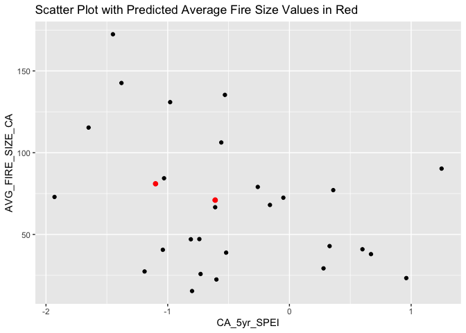

``` r
ca_fs_spei %>%
    ggplot(aes(x = Year, y = AVG_FIRE_SIZE_CA)) + geom_bar(stat = "identity", fill = "grey") +
    labs(title = "CA Average Fire Size with Predicted Values") + theme(title = element_text(size = 20),
    axis.title.x = element_text(size = 16), axis.text.x = element_text(size = 14),
    axis.text.y = element_text(size = 14), axis.title.y = element_text(size = 16))
```

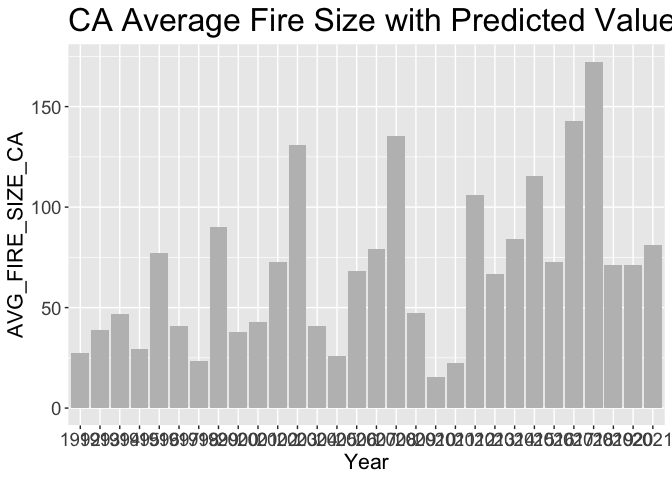
